# Week 2 — Declarative UI & Responsive Design

**Nama: Indhira Yuantika Christy**
**NIM: 244107020171**
**Mata Kuliah: Pemrograman Mobile**

---

## Tujuan Pembelajaran

* Menjelaskan prinsip declarative UI dan hubungan antara widget, konfigurasi, serta state.
* Menggunakan StatelessWidget, StatefulWidget, Container, Row, Column, dan Expanded.
* Membedakan komponen Material 3 dan Cupertino untuk kebutuhan platform yang berbeda.
* Membangun layout responsif untuk ukuran layar mobile dan tablet.
* Menerapkan theme, dark mode, styling, dan aksesibilitas dasar.

---

## Fitur Utama

* Responsive Design
* Academic Overview Dashboard
* Dark Mode dan Light Mode
* Responsive Card Layout
* Theme-aware Styling
* Accessibility dengan Semantics

---

## Teknologi yang Digunakan

| Teknologi          | Keterangan                      |
| ------------------ | ------------------------------- |
| Flutter            | Framework pengembangan aplikasi |
| Dart               | Bahasa pemrograman              |
| Android Studio     | IDE dan Android SDK             |
| Android Emulator   | Menjalankan aplikasi Android    |
| Visual Studio Code | Code editor                     |
| Git                | Version control                 |

---

## Layout Sederhana (Warm-up)

1. Menghapus Expanded pada baris nama, kemudian mengamati peringatan overflow, dan mengembalikannya setelah itu.

    Bukti screenshot:

    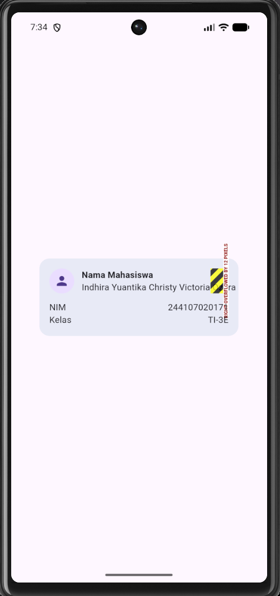

2. Mengganti mainAxisSize: MainAxisSize.min menjadi nilai default (max) dan mengamati perubahan tinggi kartu.

    Bukti screenshot:

    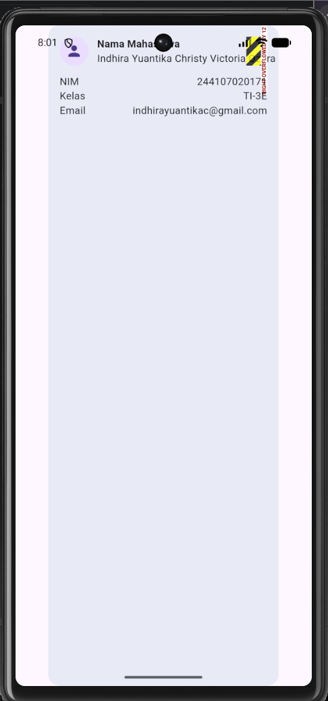

3. Menambahkan satu baris data email baru.

    Bukti screenshot:

    

---

## Dashboard Responsif

1. Menyiapkan project, run, memodifikasi kode program untuk widget statis (stateless widget).

    Bukti screenshot:

    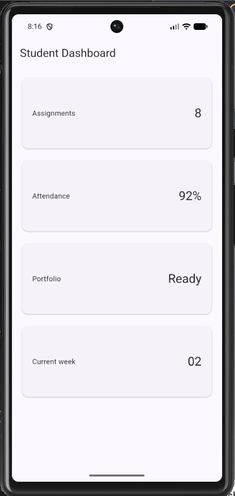

2. Menambahkan interaksi StatefulWidget dan Cupertino Switch.

    Terlihat pada tampilan aplikasi terdapat switch untuk mengatur tema. Ketika switch diaktifkan, tampilan berubah menjadi dark mode dan icon berubah menjadi dark_mode. Ketika switch dimatikan, tampilan kembali menjadi light mode.

    Bukti screenshot:

    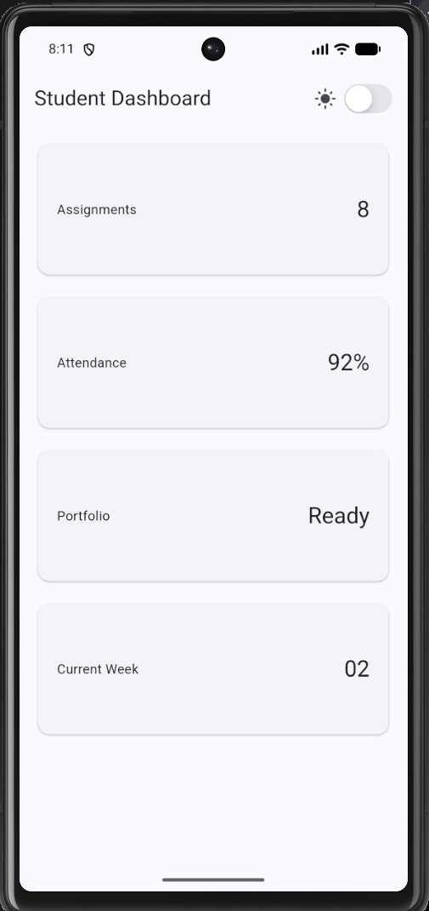

    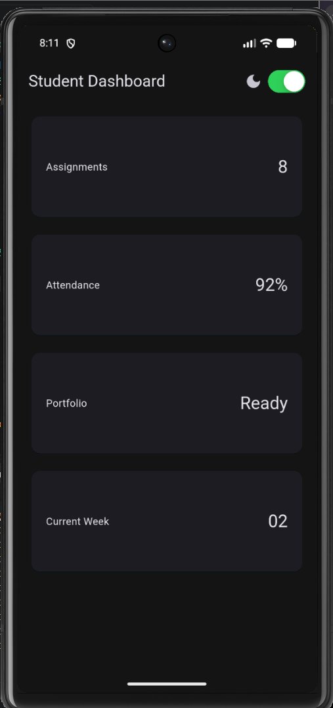

    Perbandingan dengan Switch Adaptive:

    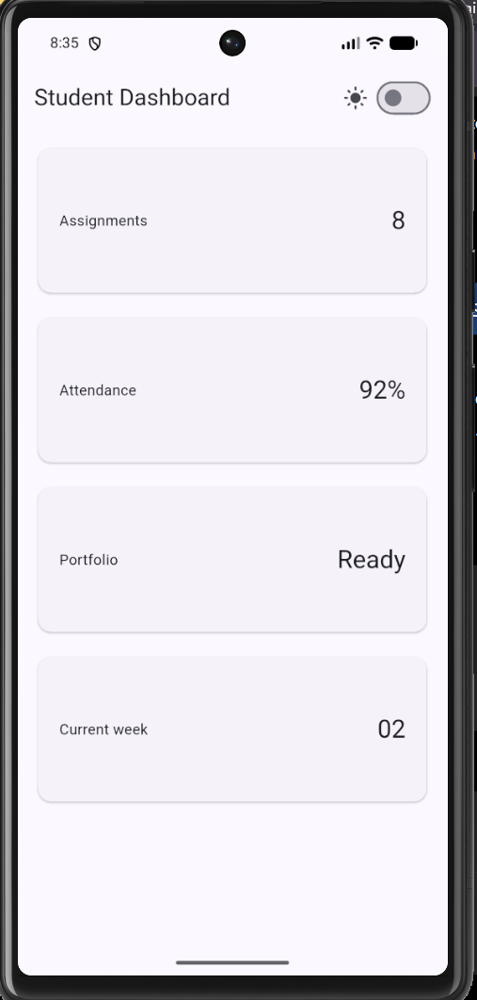

    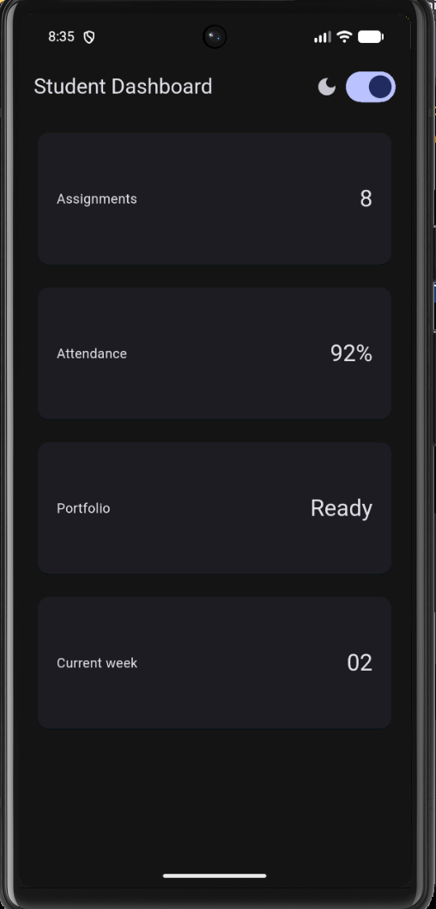

    Terlihat perbedaan tampilan antara Cupertino Switch dan Switch Adaptive, terutama pada tampilan kontrol toggle pada mode terang dan gelap.

---

## Eksperimen Layout

1. Ubah breakpoint dari 700 menjadi nilai lain dan amati perubahan jumlah kolom.

    Pada kasus ini, saya mengganti nilai breakpoint yang semula 700 menjadi 400 sesuai dengan kode program berikut:

    final columns = constraints.maxWidth >= 400 ? 2 : 1;

    Hal ini berarti breakpoint untuk memecah digunakan 2 kolom atau 1 kolom pada tampilan UI yang semula untuk perangkat dengan lebar layar minimal 700 pixel menjadi 400 pixel, Sehingga tampilan untuk perangkat dengan resolusi 412x915 menjadi 2 kolom sesuai dengan gambar berikut.

    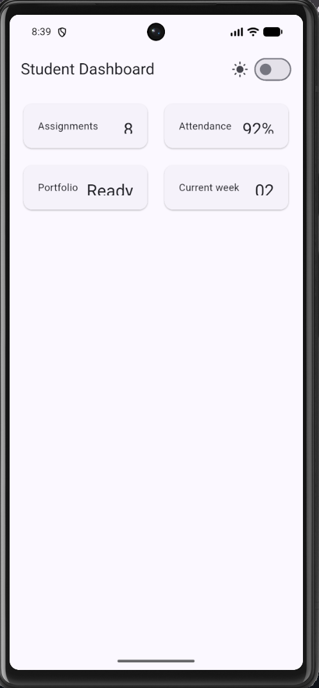

2. Ubah themeMode menjadi ThemeMode.dark, lalu kembalikan ke ThemeMode.system.

    Pada soal ini, kode program diubah agar tampilan aplikasi diubah statis menjadi dark mode saja sesuai kode program berikut:
    
    themeMode: ThemeMode.dark

    

    kemudian dikembalikan lagi menjadi setelan default dari perangkat (perangkat saya memiliki tema gelap), sesuai dengan kode program berikut:

    themeMode: ThemeMode.system,

    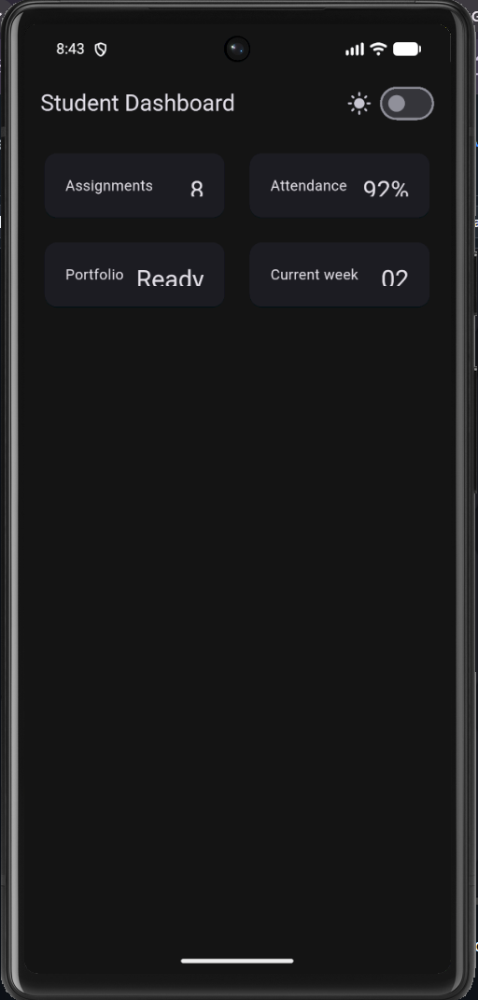

3. Uji aplikasi dengan ukuran layar emulator yang berbeda.

    Berikut merupakan tampilan aplikasi pada perangkat iPhone SE. Terlihat bahwa tampilan pada iPhone SE, kolom yang ditampilkan hanya 1 kolom, dan default dari tema sistem adalah tema gelap.

    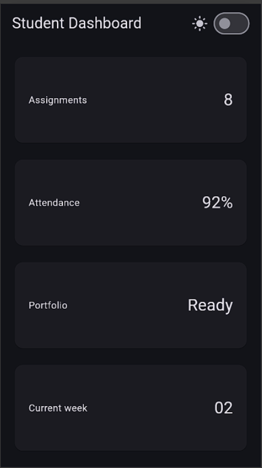

4. Tambahkan Semantics atau label yang bermakna pada elemen yang penting bagi screen reader.

    Menambahkan kode program semantics pada toggle mode gelap dan terang sesuai dengan kode program berikut:

    Semantics(
        label: 'Pengaturan tema',
        hint: isDark
            ? 'Tema gelap aktif'
            : 'Tema terang aktif',
    ),

    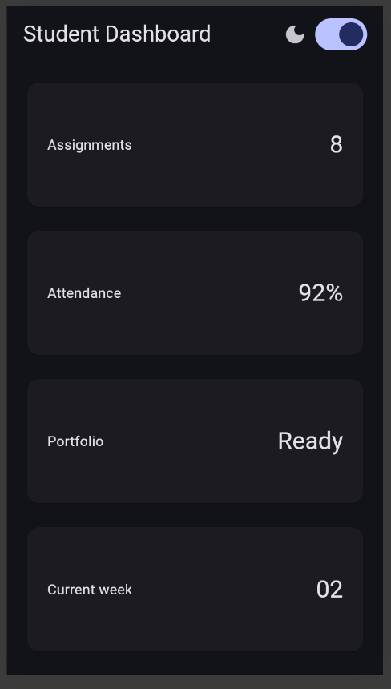

---

## Tugas Utama
Mengembangkan dashboard menjadi Academic Overview sesuai dengan ketentuan.
Berikut merupakan tampilan aplikasi setelah dikembangkan.

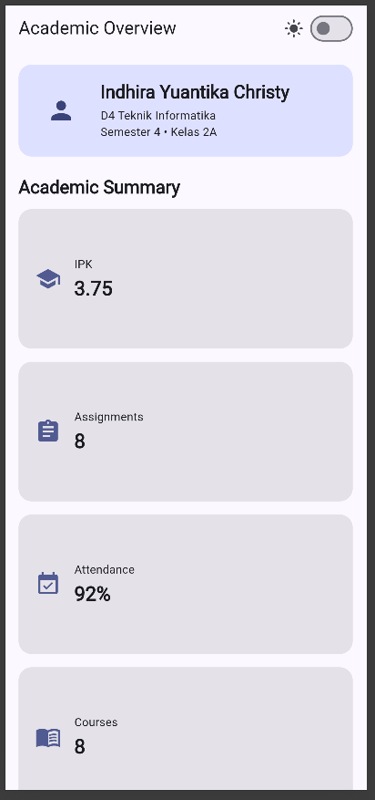

Tampilan pada layar sempit (414x896):

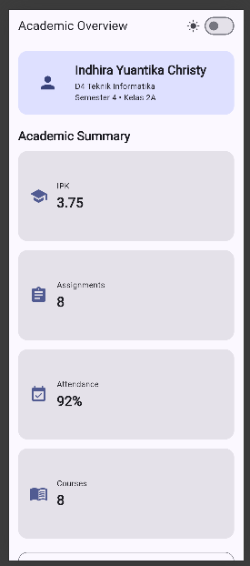

Tampilan pada layar lebar (1024x1366):

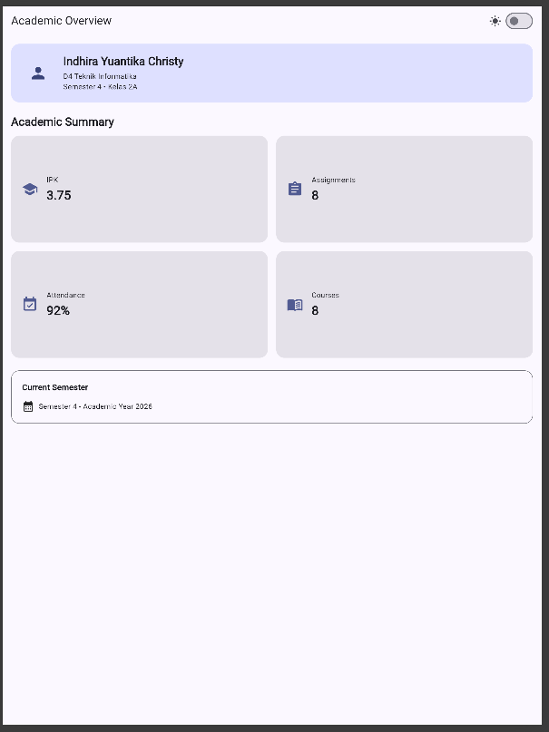

---

## AI Prompt Challenge
Menggunakan AI (Gemini & ChatGPT) untuk membandingkan dua alternatif tata letak.

1. Prompt Desain
    Prompt: Bandingkan dua tata letak dashboard akademik untuk Flutter: versi GridView dengan jumlah kolom tetap dan versi LayoutBuilder + GridView dengan breakpoint. Jelaskan trade-off responsivitas dan aksesibilitasnya.

    Jawaban: 
    Kedua pendekatan memiliki keunggulan yang berbeda. GridView dengan jumlah kolom tetap lebih sederhana, tetapi kurang fleksibel ketika ukuran layar berubah. Sementara itu, LayoutBuilder + GridView dapat menyesuaikan jumlah kolom berdasarkan lebar layar.

    a. Trade-Off Responsif

    --> GridView dengan Jumlah Kolom Tetap

    Kelebihan: Struktur kode lebih sederhana karena jumlah kolom sudah ditentukan.

    Kekurangan: Tampilan dapat menjadi terlalu rapat pada layar kecil atau terlalu renggang pada layar besar karena jumlah kolom tidak menyesuaikan ukuran layar.

    --> LayoutBuilder + GridView

    Kelebihan: Lebih responsif karena jumlah kolom dapat disesuaikan berdasarkan lebar layar menggunakan breakpoint.

    Kekurangan: Kode sedikit lebih kompleks karena membutuhkan LayoutBuilder dan kondisi breakpoint.

    b. Trade-Off Aksesibilitas

    GridView dapat membantu menyusun informasi dalam bentuk yang terstruktur. Namun, ukuran card tetap perlu diperhatikan agar teks tetap terbaca pada berbagai ukuran layar.

    Pada implementasi ini, Semantics digunakan pada pengaturan tema agar screen reader dapat memberikan informasi mengenai kondisi tema yang sedang aktif. Selain itu, penggunaan Theme.of(context) membuat warna dan teks mengikuti tema terang maupun gelap.

    Keputusan dipilih: LayoutBuilder + GridView

    Alasan Teknis:

    LayoutBuilder digunakan untuk membaca lebar layar dan menentukan jumlah kolom berdasarkan kWideBreakpoint. Pada layar sempit digunakan satu kolom, sedangkan pada layar lebar digunakan dua kolom.

    GridView.count digunakan untuk menyusun card secara rapi. Karena GridView berada di dalam SingleChildScrollView, digunakan shrinkWrap: true dan NeverScrollableScrollPhysics() sehingga scrolling utama ditangani oleh halaman.

    Bukti Verifikasi:

    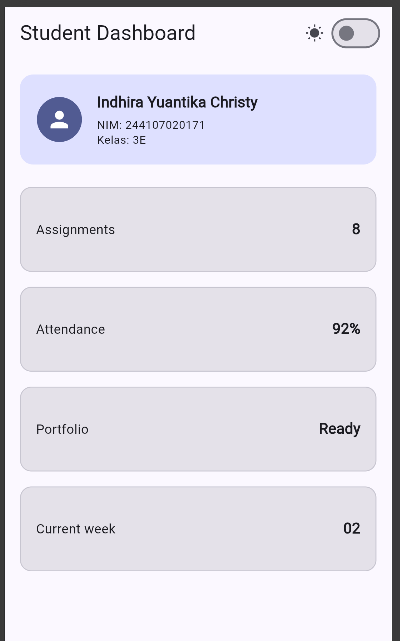

2. Prompt Penguatan Konsep

    Prompt: Jelaskan kapan penggunaan Expanded justru menyebabkan overflow di dalam Row, beri contoh kode yang gagal dan perbaikannya.

        Jawaban:

        Expanded digunakan untuk membuat widget anak mengisi ruang yang tersedia di dalam Row atau Column. Namun, Expanded dapat menyebabkan layout error ketika parent memberikan ukuran yang tidak terbatas pada arah yang sama. Salah satu contohnya adalah ketika Row berada di dalam SingleChildScrollView dengan arah scroll horizontal.

    ### Bukti Verifikasi:

        Kode Program & Tampilan saat terjadi overflow pada Expanded:

        // PERMASALAHAN: ScrollView horizontal membuat
        // lebar Row menjadi tidak terbatas (infinity)
        child: SingleChildScrollView(
            scrollDirection: Axis.horizontal,
            child: Row(
                children: [
                    const CircleAvatar(
                        radius: 32,
                        child: Icon(
                            Icons.person,
                            size: 36,
                        ),
                    ),
                    const SizedBox(width: 16),

                    // ERROR: Expanded tidak dapat menentukan
                    // sisa ruang karena lebar Row tidak terbatas
                    Expanded(
                        child: Column(
                            crossAxisAlignment: CrossAxisAlignment.start,
                            children: [
                                Text(
                                'Indhira Yuantika Christy',
                                style: Theme.of(context)
                                    .textTheme
                                    .titleLarge
                                    ?.copyWith(
                                        fontWeight: FontWeight.bold,
                                    ),
                                ),
                                const SizedBox(height: 4),
                                const Text('D4 Teknik Informatika'),
                                const Text('Semester 5 • Kelas 3E'),
                                ],
                            ),
                        ),
                    ],
                ),
            ),

        Kode program & tampilan untuk solusi dari overflow pada Expanded:

        // SOLUSI: Expanded dihapus karena Row berada
        // di dalam SingleChildScrollView horizontal
        child: SingleChildScrollView(
            scrollDirection: Axis.horizontal,
            child: Row(
                children: [
                    const CircleAvatar(
                        radius: 32,
                        child: Icon(
                            Icons.person,
                            size: 36,
                        ),
                    ),
                    const SizedBox(width: 16),

                    // Column digunakan langsung tanpa Expanded
                    Column(
                        crossAxisAlignment: CrossAxisAlignment.start,
                        children: [
                            Text(
                                'Indhira Yuantika Christy',
                                style: Theme.of(context)
                                    .textTheme
                                    .titleLarge
                                    ?.copyWith(
                                    fontWeight: FontWeight.bold,
                                    ),
                                ),
                            const SizedBox(height: 4),
                            const Text('D4 Teknik Informatika'),
                            const Text('Semester 5 • Kelas 3E'),
                        ],
                    ),
                ],
            ),
        ),

        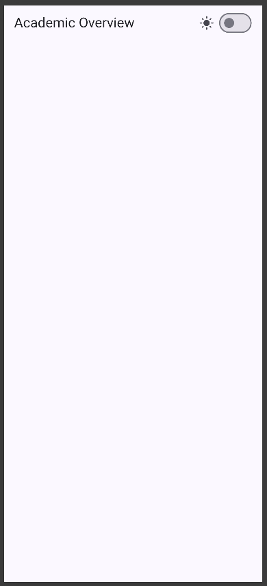

        Pada kode final aplikasi, Expanded tetap digunakan pada bagian header karena Row berada di dalam Container yang memiliki lebar terbatas. Dengan kondisi tersebut, Expanded dapat menggunakan sisa ruang yang tersedia secara normal.

3. Verification Prompt

    Prompt: Periksa kembali rekomendasi layout di atas: apakah tetap responsif di bawah 600px, apakah mengurangi aksesibilitas, dan apakah ada widget yang tidak tersedia di Flutter stabil saat ini?
    Jawaban: 

    1. Ketersediaan Widget di Flutter Stabil
    Semua widget yang digunakan dalam implementasi merupakan widget bawaan Flutter, seperti LayoutBuilder, GridView.count, Switch.adaptive, Semantics, Row, Column, Container, dan Expanded. Tidak digunakan package pihak ketiga untuk membangun layout utama aplikasi.

    2. Responsivitas di Bawah 600px (Layar HP Sempit)
    Dengan breakpoint kWideBreakpoint = 700, layar dengan lebar kurang dari 700px akan menggunakan crossAxisCount sebesar 1. Dengan demikian, pada layar HP dengan lebar di bawah 600px, card akan ditampilkan dalam satu kolom.

    Pada layar dengan lebar minimal 700px, crossAxisCount berubah menjadi 2 sehingga card ditampilkan dalam dua kolom.

    3. Dampak Terhadap Aksesibilitas
    Penggunaan Semantics pada pengaturan tema membantu screen reader memberikan informasi yang lebih bermakna kepada pengguna. Selain itu, penggunaan Theme.of(context) membuat warna dan teks mengikuti tema terang maupun gelap sehingga tampilan tetap menyesuaikan kondisi tema.

    Bukti Verifikasi:

    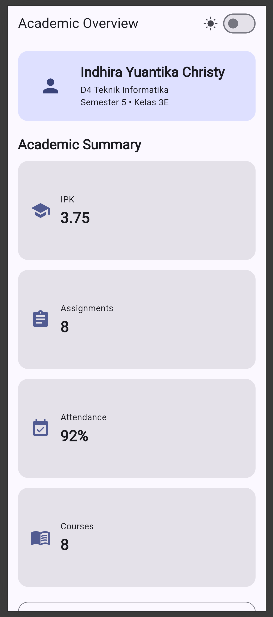

--- 

## Refactoring Challenge

1. Ekstrak kartu informasi menjadi widget reusable (misal InfoCard) yang menerima title dan value, sehingga tidak ada duplikasi widget.

    Memodifikasi kode program dengan membuat InfoCard sebagai widget reusable sehingga kode untuk setiap kartu informasi tidak perlu ditulis berulang kali.

    Pada implementasi final, InfoCard menerima icon, title, dan value.
    ### Kode program:
    class InfoCard extends StatelessWidget {
        const InfoCard({
            required this.icon,
            required this.title, 
            required this.value, 
            super.key
        });
        final IconData icon;
        final String title;
        final String value;
    }

2. Ganti warna dan styling dengan Theme.of(context)

    Pada implementasi final, warna dan style yang berkaitan dengan tema menggunakan Theme.of(context) agar dapat mengikuti tema terang dan gelap.

    ### Contoh kode program:
    color: Theme.of(context).colorScheme.primaryContainer,
    style: Theme.of(context).textTheme.titleMedium?.copyWith(
        fontWeight: FontWeight.bold,
        ),

3. Pindahkan breakpoint ke satu konstanta

    Breakpoint dipindahkan ke satu konstanta agar nilai breakpoint hanya didefinisikan satu kali.
    
    Kode program:
    const double kWideBreakpoint = 700;
    final columns =
    constraints.maxWidth >= kWideBreakpoint ? 2 : 1;

4. Menjalankan flutter analyze

    Perintah flutter analyze dijalankan untuk memastikan tidak terdapat error maupun warning baru pada kode program.
    Bukti screenshot:

    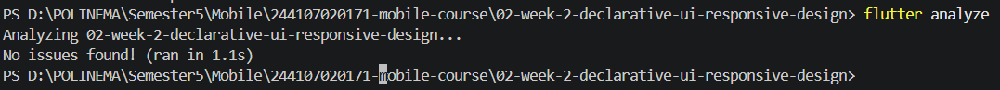

---

## Testing Dasar
Menambahkan widget test untuk memverifikasi responsivitas layout pada ukuran layar sempit dan lebar. Pengujian dilakukan menggunakan perintah flutter test.

Hasil pengujian menunjukkan bahwa pada layar sempit card ditampilkan dalam satu kolom, sedangkan pada layar lebar card ditampilkan dalam dua kolom.

Hasil flutter test:

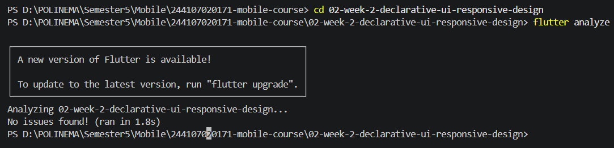

---

## Checklist Verifikasi

1. flutter analyze tidak menghasilkan error.

    Screenshot:

    

2. flutter test lulus semua widget test responsif.

    Screenshot:

    .png)

3. Aplikasi dapat dijalankan pada ukuran layar sempit dan lebar.

    Screenshot:
    Layar sempit:

    

    Layar lebar:

    

4. Dark mode memiliki kontras dan teks yang terbaca.

    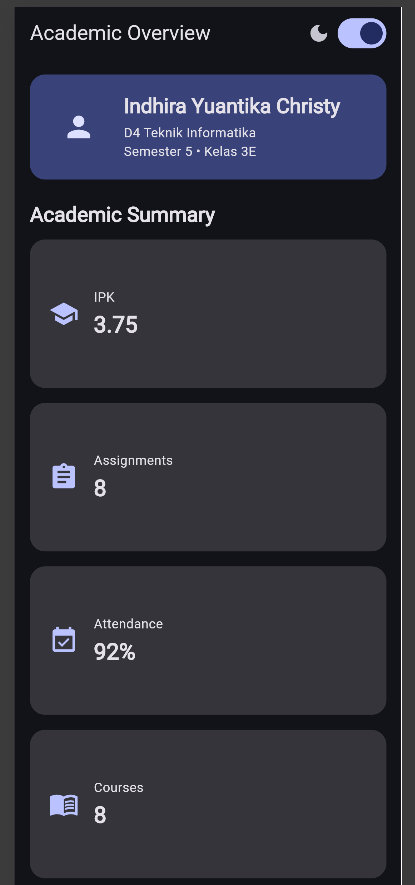

5. Struktur widget dapat dijelaskan saat code review.
6. Screenshot, folder test/, dan README sudah tersimpan pada folder tugas Week 2.

---

## Konsep yang Dipelajari

1. Declarative UI
Declarative UI merupakan pendekatan pembuatan antarmuka dengan mendeskripsikan tampilan yang diinginkan berdasarkan kondisi aplikasi.

2. Widget Tree
Widget tree merupakan struktur hierarki widget yang digunakan untuk membentuk tampilan aplikasi Flutter.

3. Responsive Design
Responsive design merupakan pendekatan untuk membuat tampilan aplikasi dapat menyesuaikan ukuran layar yang berbeda.

4. LayoutBuilder
LayoutBuilder digunakan untuk mengetahui ukuran ruang yang tersedia sehingga tampilan dapat disesuaikan berdasarkan ukuran layar.

5. Theme
Theme digunakan untuk mengatur tampilan aplikasi seperti warna, brightness, dan style secara konsisten. Pada aplikasi ini digunakan **Light Theme** dan **Dark Theme**.

---

## Kendala Setup

Kendala yang saya temui adalah perbedaan ukuran layar saat menguji tampilan aplikasi. Pada layar yang lebih kecil, beberapa komponen dapat mengalami perubahan posisi atau overflow jika layout tidak diatur dengan baik.

Untuk mengatasi kendala tersebut, saya menggunakan LayoutBuilder dan GridView agar tampilan dapat menyesuaikan ukuran layar. Saya juga melakukan pengujian pada ukuran layar yang berbeda untuk memastikan layout tetap rapi dan responsif.

---

## Refleksi
1. Apa perbedaan cara berpikir imperative dan declarative saat membangun UI?

    Jawaban:
    Cara berpikir imperative berfokus pada langkah-langkah yang harus dilakukan untuk mengubah tampilan UI. Sedangkan declarative berfokus pada kondisi atau tampilan yang ingin dihasilkan. Pada Flutter, pendekatan declarative membuat UI dibangun berdasarkan state dan kondisi yang sedang aktif.

2. Kapan Expanded membantu dan kapan penggunaannya justru menghasilkan layout error?

    Jawaban:
    Expanded membantu ketika widget berada di dalam Row atau Column dengan ruang yang tersedia dan ingin membagi ruang tersebut secara fleksibel. Namun, Expanded dapat menyebabkan layout error jika parent memberikan ukuran yang tidak terbatas pada arah yang sama, seperti Row di dalam horizontal SingleChildScrollView.

3. Bagaimana breakpoint dan theme memengaruhi pengalaman pengguna?

    Jawaban:
    Breakpoint membuat tampilan dapat menyesuaikan ukuran layar. Pada layar sempit, card ditampilkan dalam satu kolom, sedangkan pada layar lebar menjadi dua kolom. Theme juga memengaruhi kenyamanan pengguna melalui pilihan tema terang dan gelap, sehingga tampilan dapat disesuaikan dengan kondisi dan preferensi pengguna.

4. Apa yang Anda verifikasi dari rekomendasi AI setelah tugas inti selesai?

    Jawaban:
    Rekomendasi AI diverifikasi dengan menjalankan aplikasi dan melakukan pengujian menggunakan flutter analyze dan flutter test. Selain itu, responsive layout diuji pada ukuran layar sempit dan lebar untuk memastikan breakpoint bekerja sesuai kebutuhan. Hasil pengujian digunakan untuk memastikan bahwa rekomendasi AI tidak hanya diterapkan, tetapi juga benar-benar berjalan pada aplikasi.

---

## Kesimpulan

Praktikum minggu kedua berhasil dilakukan. Aplikasi Academic Overview dapat dibuat dengan menerapkan konsep Declarative UI dan Responsive Design. Tampilan aplikasi dapat menyesuaikan ukuran layar menggunakan LayoutBuilder, serta mendukung Light Theme dan Dark Theme. Pengujian pada ukuran layar yang berbeda juga berhasil dilakukan untuk memastikan tampilan tetap responsif.
