# 03-week-3-navigation-state-management

## Tujuan 

1. Menjelaskan konsep navigasi, route, dan perbedaan Navigator 1.0 dengan GoRouter;
2. Menerapkan navigasi multi-page dengan GoRouter, termasuk passing argument dan deep link sederhana;
3. Menjelaskan mengapa state management diperlukan dan cara kerja Riverpod (Provider, ConsumerWidget, Notifier);
4. Menggunakan AsyncValue untuk menangani state loading, error, dan success pada UI;
5. Membangun aplikasi ToDo dengan navigasi dan Riverpod, lalu memverifikasi hasilnya dengan widget test sederhana.

## Praktikum 1 - Aplikasi multi-page dengan GoRouter

Menjalankan dan mengamati terhadap pages yang telah dibuat pada class MyApp, HomePage, dan DetailPage.

Berikut merupakan tampilan aplikasi.

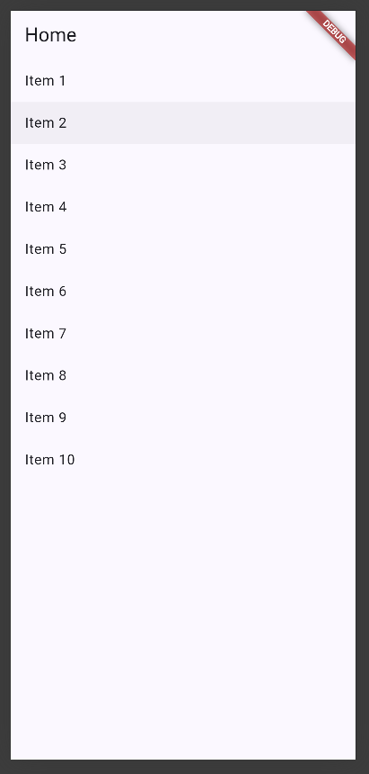

Berikut merupakan tampilan ketika menekan salah satu item.

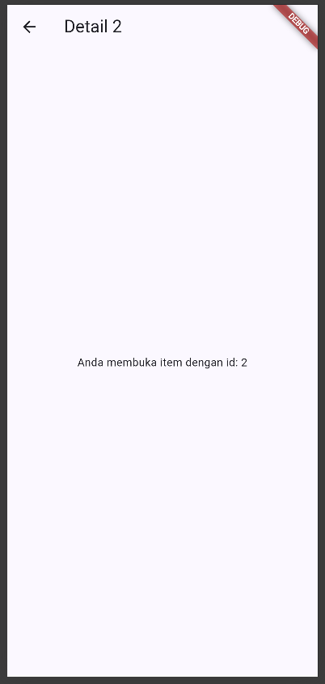

Terlihat dari kedua hasil screenshot tersebut bahwa path yang ada mengikuti id dari setiap item, dan dapat diakses tanpa melalui page home.

## Praktikum 2 - Aplikasi ToDo dengan Riverpod 

Menjalankan dan memerhatikan pola mengenai ref.watch di dalam build dan ref.read di dalam callback.

Berikut merupakan tampilan awal untuk aplikasi ToDo.

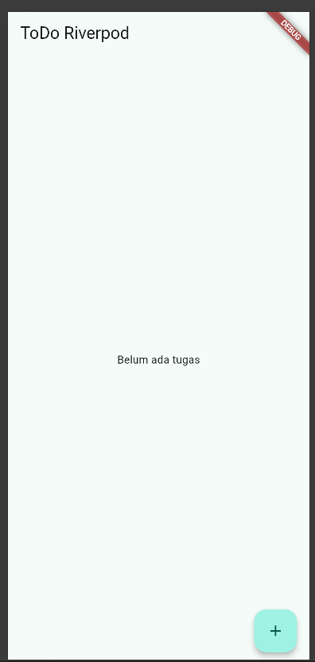

Berikut adalah tampilan widget untuk menambahkan tugas.

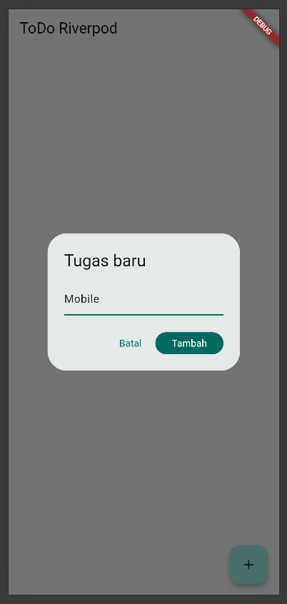

Berikut adalah tampilan sesudah menambahkan tugas baru.

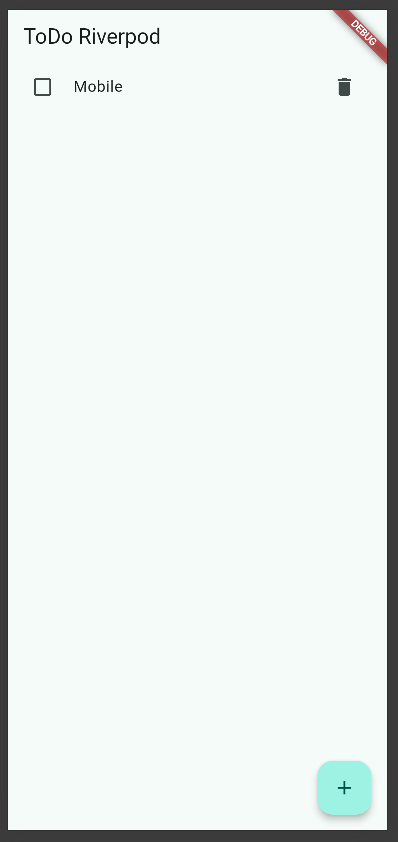

Pada praktikum ini, terlihat pola bahwa ref.watch bertugas untuk mengawasi bagian halaman ketika terdapat data yang masuk, maka ia akan secara otomatis menampilkan data tersebut. Sedangkan untuk ref.read(todoListProvider.notifier), ia digunakan untuk memanggil fungsi add, toggle, dan remove tanpa perlu mengawasi halaman.

## Praktikum 3 - Uji ketiga state

1. Salin kode di atas ke project ToDo Anda (atau project terpisah) dan jalankan. Amati tampilan loading selama 2 detik pertama.

    Berikut merupakan tampilan awal untuk tampilan loading selama 2 detik pertama dan setelah 2 detik.

    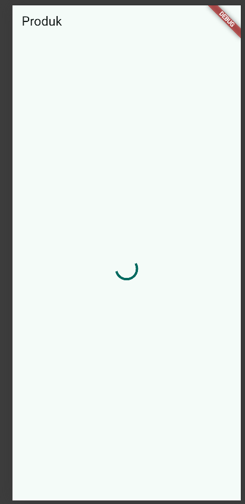

    Setelah 2 detik pertama.

    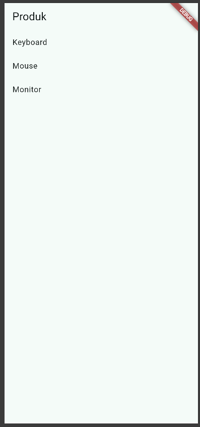

2. Ubah build() sementara untuk melempar error: throw Exception('Gagal terhubung ke server');. Jalankan dan amati UI error beserta tombol Coba lagi.

    Setelah menambahkan `throw Exception('Gagal terhubung ke server')` pada method
    `build()` di `ProductsNotifier`, proses pengambilan data sengaja dibuat gagal. Setelah state loading selesai, Riverpod menghasilkan state error sehingga UI menampilkan pesan kegagalan beserta tombol **Coba lagi**.

    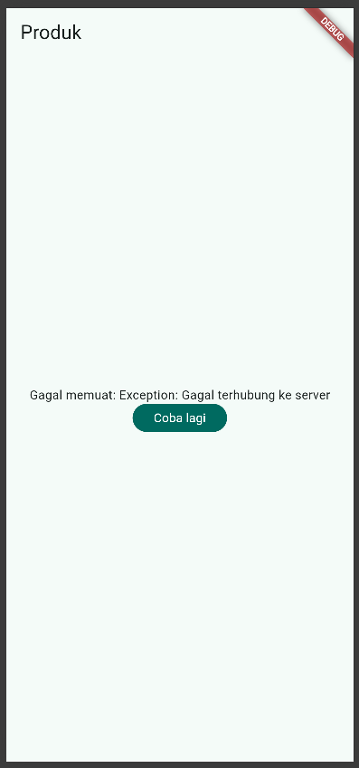

    Ketika tombol **Coba lagi** ditekan, `ref.invalidate(productsProvider)` akan menjalankan provider kembali. Namun, karena `throw Exception` masih terdapat di dalam `build()`, provider kembali menghasilkan state error.

3. Tekan tombol Coba lagi, ref.invalidate membuat provider dijalankan ulang. Pulihkan kode, pastikan state success tampil.

    Setelah memulihkan kode program dengan menghapus kode throw Exceptionnya, maka aplikasi akan memanggil metode build() kembali dan menampilkan list sesuai dengan state success.

    .png)

4. Refleksikan: mengapa menampilkan ulang data lama (stale data) dengan indikator refresh kadang lebih baik daripada mengosongkan layar? Kapan pola itu penting?

    Menampilkan ulang data lama dengan indikator refresh lebih baik daripada mengosongkan layar, hal ini dikarenakan pengguna akan pasti paham ketika menekan tombol Coba Lagi dan muncul indikator refresh yang menandakan sistem sedang mencoba untuk mengambil suatu data. Tanpa adanya indikator tersebut, terdapat kemungkinan bahwa pengguna tidak dapat memahami apa yang sebenarnya terjadi pada aplikasinya. Pola ini penting ketika terdapat suatu event di aplikasi yang krusial, misal ketika pembayaran, feed sosial media, maupun aplikasi yang memerlukan internet sehingga menandakan jaringan dari perangkat yang terganggu. Sehingga pengguna dapat memahami konteks dari aplikasi tersebut.

# AI Challenge

## 1. AI Agent yang Digunakan

AI Agent yang digunakan dalam pengerjaan challenge ini adalah **ChatGPT**.

---

## 2. Prompt yang Digunakan

Prompt yang diberikan kepada AI:

```text
Buatkan halaman Flutter bernama StatsPage menggunakan flutter_riverpod.
Requirements:
- ConsumerWidget dengan satu AsyncNotifierProvider yang mensimulasikan
  pengambilan data statistik (delay 2 detik, kadang gagal 30%).
- UI harus menangani loading (spinner), error (pesan + tombol retry),
  dan success (ListView 3 item).
- Berikan widget test untuk memastikan UI bereaksi terhadap perubahan state. Jelaskan setiap bagian kode dalam komentar.
```

---

## 3. Output Awal AI

### `stats_provider.dart`

import 'dart:math';

import 'package:flutter_riverpod/flutter_riverpod.dart';

// Notifier ini mengelola data statistik yang dimuat secara asynchronous.
class StatsNotifier extends AsyncNotifier<List<String>> {
  @override
  Future<List<String>> build() async {
    // Simulasi proses mengambil data dari server selama 2 detik.
    await Future.delayed(const Duration(seconds: 2));

    // Menghasilkan angka acak untuk mensimulasikan kemungkinan gagal 30%.
    final random = Random();

    if (random.nextDouble() < 0.3) {
      throw Exception('Gagal mengambil data statistik');
    }

    // Data dikembalikan sebagai List baru sehingga tidak melakukan
    // mutasi langsung terhadap state.
    return [
      'Total Pengguna: 120',
      'Pengguna Aktif: 85',
      'Total Transaksi: 240',
    ];
  }
}

// Provider memiliki tipe eksplisit.
final statsProvider =
    AsyncNotifierProvider<StatsNotifier, List<String>>(
      StatsNotifier.new,
    );
```

### `stats_page.dart`

import 'package:flutter/material.dart';
import 'package:flutter_riverpod/flutter_riverpod.dart';

import '../providers/stats_provider.dart';

// ConsumerWidget digunakan karena halaman perlu mengamati provider Riverpod.
class StatsPage extends ConsumerWidget {
  const StatsPage({super.key});

  @override
  Widget build(BuildContext context, WidgetRef ref) {
    // ref.watch digunakan di dalam build agar UI otomatis diperbarui
    // ketika state statsProvider berubah.
    final statsAsync = ref.watch(statsProvider);

    return Scaffold(
      appBar: AppBar(
        title: const Text('Statistik'),
      ),
      body: statsAsync.when(
        // State loading ditampilkan ketika data sedang diambil.
        loading: () => const Center(
          child: CircularProgressIndicator(),
        ),

        // State error menampilkan pesan kesalahan dan tombol retry.
        error: (error, stackTrace) => Center(
          child: Column(
            mainAxisSize: MainAxisSize.min,
            children: [
              Text('Gagal memuat statistik: $error'),
              const SizedBox(height: 12),
              FilledButton(
                // invalidate memaksa provider menjalankan build() kembali.
                onPressed: () {
                  ref.invalidate(statsProvider);
                },
                child: const Text('Coba lagi'),
              ),
            ],
          ),
        ),

        // State success menampilkan tiga data statistik menggunakan ListView.
        data: (stats) => ListView.builder(
          itemCount: stats.length,
          itemBuilder: (context, index) {
            return ListTile(
              leading: const Icon(Icons.bar_chart),
              title: Text(stats[index]),
            );
          },
        ),
      ),
    );
  }
}

### `main.dart`

import 'package:flutter/material.dart';
import 'package:flutter_riverpod/flutter_riverpod.dart';

import 'pages/stats_page.dart';

void main() => runApp(
      ProviderScope(
        retry: (retryCount, error) => null,
        child: const MyApp(),
      ),
    );

class MyApp extends StatelessWidget {
  const MyApp({super.key});

  @override
  Widget build(BuildContext context) => MaterialApp(
        title: 'Week 3 - AI Challenge',
        theme: ThemeData(
          colorSchemeSeed: Colors.teal,
          useMaterial3: true,
        ),
        home: const StatsPage(),
      );
}
```

Konfigurasi `retry` pada `ProviderScope` digunakan karena project menggunakan
`flutter_riverpod 3.4.3`. Automatic retry dinonaktifkan agar ketika simulasi
pengambilan data gagal, state error dapat langsung diamati pada UI sesuai
kebutuhan praktikum.

---

## 4. Hasil Implementasi

### Tampilan Loading

Pada saat `StatsNotifier` melakukan simulasi pengambilan data selama 2 detik,
aplikasi menampilkan `CircularProgressIndicator`.

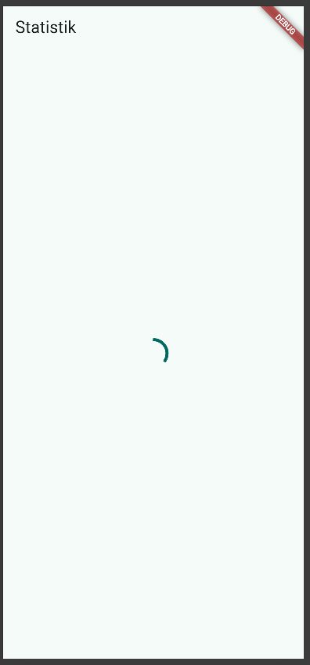

### Tampilan Success

Apabila proses pengambilan data berhasil, aplikasi menampilkan tiga data
statistik menggunakan `ListView`.


### Tampilan Error

Apabila simulasi menghasilkan kegagalan, aplikasi menampilkan pesan error
beserta tombol **Coba lagi**.

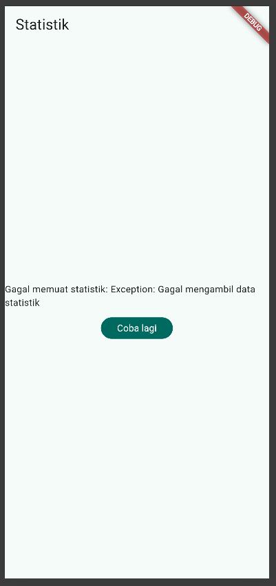

---

## 5. AI Verification Checklist

### a. Apakah state diubah secara immutable?

**Ya.**

Data statistik dibuat dan dikembalikan sebagai `List<String>` baru dari method
`build()`. Tidak ditemukan penggunaan `state.add()`, `state.remove()`, atau
mutasi langsung terhadap list yang tersimpan pada state.

Contoh:

return [
  'Total Pengguna: 120',
  'Pengguna Aktif: 85',
  'Total Transaksi: 240',
];

Dengan demikian, implementasi telah mengikuti prinsip immutable state.

### b. Apakah `ref.watch` hanya dipakai di dalam `build`, dan `ref.read` di callback?

**Ya untuk penggunaan `ref.watch`.**

`ref.watch(statsProvider)` hanya digunakan di dalam method `build()` pada
`StatsPage`.

final statsAsync = ref.watch(statsProvider);

Pada callback tombol retry tidak diperlukan `ref.watch`. Implementasi
menggunakan:

ref.invalidate(statsProvider);

untuk menginvalidasi state lama dan menjalankan kembali provider.

Dengan demikian, tidak terdapat penggunaan `ref.watch` di dalam callback.

### c. Apakah ketiga state `AsyncValue` benar-benar ditangani?

**Ya.**

Ketiga state `AsyncValue` ditangani menggunakan method `when()`:

- `loading` menampilkan `CircularProgressIndicator`.
- `error` menampilkan pesan kesalahan dan tombol **Coba lagi**.
- `data` menampilkan tiga data statistik menggunakan `ListView`.

statsAsync.when(
  loading: () => const Center(
    child: CircularProgressIndicator(),
  ),
  error: (error, stackTrace) => ...,
  data: (stats) => ListView.builder(...),
);

Pengujian secara langsung juga menunjukkan bahwa ketiga kondisi tersebut dapat
ditampilkan oleh aplikasi.

### d. Apakah provider dideklarasikan dengan tipe eksplisit dan tidak duplikat dengan provider lain?

**Ya.**

Provider dideklarasikan menggunakan:

AsyncNotifierProvider<StatsNotifier, List<String>>

dengan nama:

statsProvider

Provider tersebut memiliki nama yang berbeda dari provider lain yang sebelumnya
digunakan pada project, seperti `todoListProvider` dan `productsProvider`,
sehingga tidak terjadi duplikasi provider.

### e. Apakah kode AI menggunakan API Riverpod versi lama?

**Tidak.**

Implementasi tidak menggunakan `StateProvider`, `StateNotifierProvider`, maupun
`Consumer` bertingkat.

State asynchronous dikelola menggunakan:

AsyncNotifier<List<String>>

dan:

AsyncNotifierProvider<StatsNotifier, List<String>>

Sedangkan halaman menggunakan:

class StatsPage extends ConsumerWidget

Dengan demikian, implementasi telah menggunakan pola Riverpod yang sesuai
dengan materi, yaitu `AsyncNotifier`, `AsyncNotifierProvider`, dan
`ConsumerWidget`.

### f. Apakah `flutter analyze` dan `flutter test` berhasil?

Setelah menjalankan `flutter analyze`, tidak ditemukan masalah pada kode program.

Hasil:

`No issues found! (ran in 3.4s)`

Bukti screenshot:

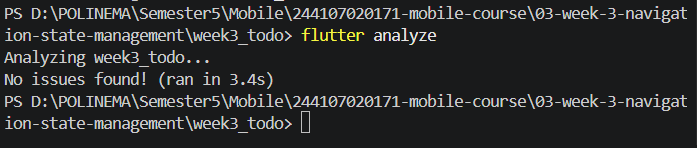

Kemudian dilakukan pengujian dengan:
flutter test

Setelah menjalankan `flutter test`, ditemukan error pada pengujian
`Counter increments smoke test` di file `test/widget_test.dart`.

Error terjadi karena pengujian tersebut masih merupakan test bawaan
project Flutter yang mencari tampilan counter dengan teks "0" dan "1".
Sementara itu, aplikasi telah diubah menjadi StatsPage sehingga widget
counter tersebut sudah tidak tersedia.

Pesan error yang muncul antara lain:

`Expected: exactly one matching candidate`
`Actual: Found 0 widgets with text "0"`

Dengan demikian, kegagalan `flutter test` berasal dari `widget_test.dart`
bawaan yang sudah tidak sesuai dengan implementasi aplikasi saat ini.

Bukti screenshot:


---

## 6. Kesimpulan Verifikasi AI

Berdasarkan proses verifikasi, kode yang dihasilkan AI telah menggunakan
`AsyncNotifierProvider` dan `ConsumerWidget` serta menangani kondisi loading,
error, dan success menggunakan `AsyncValue`.

Kode AI tidak langsung diterima tanpa pemeriksaan. Implementasi diperiksa
kembali dari sisi immutable state, penggunaan `ref.watch`, deklarasi provider,
API Riverpod yang digunakan, serta hasil `flutter analyze` dan `flutter test`.

Penyesuaian juga dilakukan terhadap Riverpod versi 3.4.3 dengan menonaktifkan
automatic retry pada `ProviderScope` agar state error dapat diamati sesuai
kebutuhan praktikum.

## Refactor Challenge

1. Pisahkan widget bar ToDo menjadi TodoTile tersendiri agar build lebih pendek dan mudah diuji.

2. Ekstrak logika filter (misal tampilkan hanya yang belum selesai) menjadi Provider turunan yang membaca todoListProvider.

    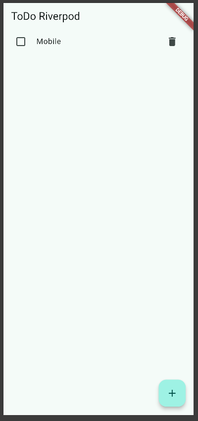

3. Integrasikan aplikasi ToDo dengan GoRouter: / untuk daftar dan /stats untuk halaman statistik, tambahkan NavigationBar untuk berpindah.

    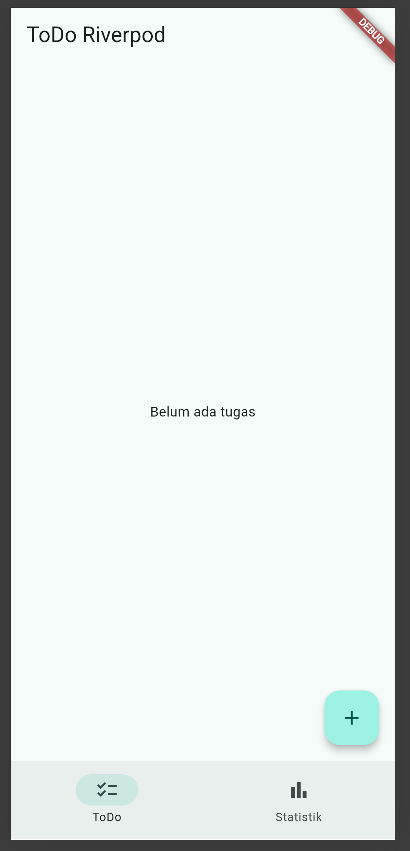

4. Flutter Test

    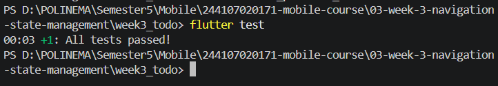

5. Flutter Analyze

    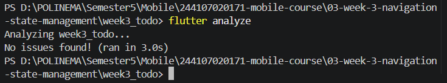

## Mini Project

1. Minimal 2 halaman dengan GoRouter: daftar tugas, halaman detail/statistik.

2. State dikelola Riverpod (Notifier), UI menggunakan ConsumerWidget.

3. Tambahkan fitur simulasi asinkron dengan AsyncValue: state loading, error, dan success tampil dengan benar.

4. Sertakan minimal 1 unit/widget test yang lulus.

5. Kerjakan bagian AI Challenge dan dokumentasikan prompt, hasil AI, perbaikan, serta alasan keputusan teknis Anda.

6. Push ke repository portfolio pada folder 03-week-3-navigation-state-management/ dengan struktur lib/, test/, README.md, dan screenshots/. README menjelaskan tujuan, fitur utama, stack teknologi, cara menjalankan, dan hasil yang dicapai.

    Semua tahapan untuk Mini Project ini telah dilakukan sesuai dengan tahapan di file Readme ini dan kode program pada folder 03-week-3-navigation-state-management.

## Refeksi

1. Kapan setState masih cukup, dan kapan state harus naik ke Riverpod?

    Jawaban: setState digunakan jika data hanya ada untuk satu widget visual saja dan tidak mempengaruhi layar lain. Sedangkan state harus naik ke Riverpod jika data tersebut digunakan oleh banyak widget visual.

2. Apa perbedaan context.go dan context.push, dan kapan masing-masing tepat digunakan?

    Jawaban : Perbedaan utama kedua metode ini terletak pada cara pengelolaan navigation stack. Perintah context.go bekerja dengan mengganti seluruh tumpukan halaman sesuai dengan skema URL yang dituju. Metode ini tepat digunakan untuk navigasi utama aplikasi. Sebaliknya, context.push bekerja dengan menumpuk halaman baru di atas halaman yang sedang aktif tanpa menghapus halaman di bawahnya. Metode ini ideal digunakan untuk membuka layar turunan, seperti halaman detail tugas atau form pengeditan, di mana pengguna diharapkan dapat kembali ke layar sebelumnya menggunakan tombol kembali.

3. Bagaimana AsyncValue mencegah bug dibanding tiga boolean terpisah?

    Jawaban: Pendekatan yang mengandalkan tiga variabel status terpisah rentan menimbulkan bug logika invalid state. AsyncValue dari Riverpod memecahkan masalah ini dengan menerapkan arsitektur sealed class, yang menjamin bahwa state aplikasi hanya bisa berada pada satu dari tiga kondisi sah pada satu waktu yakni antara AsyncLoading, AsyncError, atau AsyncData.

4. Bagian mana dari hasil AI yang Anda perbaiki, dan mengapa?

    Jawaban: Bagian yang diperbaiki meliputi konfigurasi `ProviderScope`,
    navigasi, serta pengujian. Pada Riverpod 3.4.3, automatic retry
    dinonaktifkan agar state error dapat diamati sesuai kebutuhan praktikum.
    Aplikasi kemudian diintegrasikan dengan GoRouter agar halaman ToDo dan
    Statistik dapat diakses melalui route `/` dan `/stats`.

    Pengujian bawaan Flutter juga diperbaiki karena masih menguji aplikasi
    counter yang sudah tidak digunakan. Widget test kemudian disesuaikan untuk
    menguji proses penambahan ToDo. Setelah perbaikan, `flutter analyze`
    menghasilkan `No issues found!` dan `flutter test` menghasilkan
    `All tests passed!`.