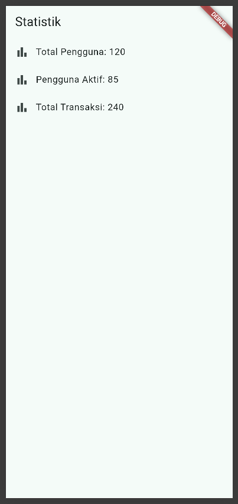
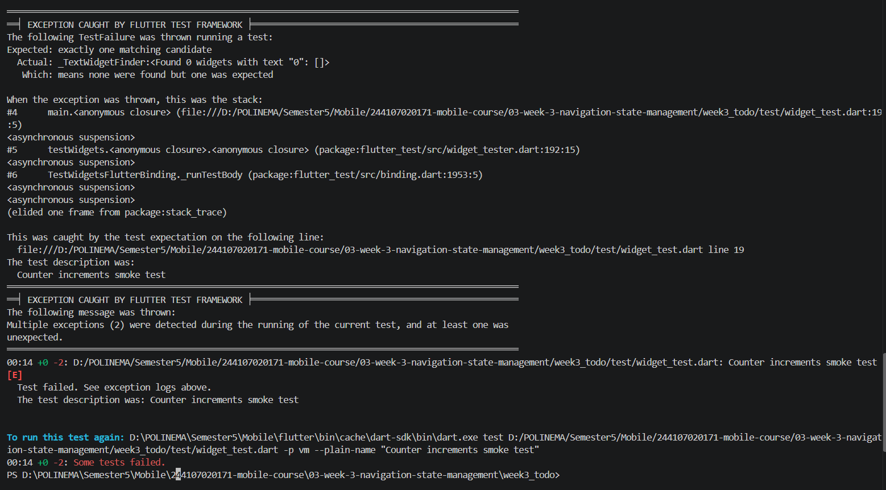

# 03-week-3-navigation-state-management

## Tujuan 

1. Menjelaskan konsep navigasi, route, dan perbedaan Navigator 1.0 dengan GoRouter;
2. Menerapkan navigasi multi-page dengan GoRouter, termasuk passing argument dan deep link sederhana;
3. Menjelaskan mengapa state management diperlukan dan cara kerja Riverpod (Provider, ConsumerWidget, Notifier);
4. Menggunakan AsyncValue untuk menangani state loading, error, dan success pada UI;
5. Membangun aplikasi ToDo dengan navigasi dan Riverpod, lalu memverifikasi hasilnya dengan widget test sederhana.

## Praktikum 1 - Aplikasi multi-page dengan GoRouter

Menjalankan dan mengamati terhadap pages yang telah dibuat pada class MyApp, HomePage, dan DetailPage.

Berikut merupakan tampilan aplikasi.

Berikut merupakan tampilan ketika menekan salah satu item.

Terlihat dari kedua hasil screenshot tersebut bahwa path yang ada mengikuti id dari setiap item, dan dapat diakses tanpa melalui page home.

## Praktikum 2 - Aplikasi ToDo dengan Riverpod 

Menjalankan dan memerhatikan pola mengenai ref.watch di dalam build dan ref.red di dalam callback.

Berikut merupakan tampilan awal untuk aplikasi ToDo.

Berikut adalah tampilan widget untuk menambahkan tugas.

Berikut adalah tampilan sesudah menambahkan tugas baru.

Pada praktikum ini, terlihat pola bahwa ref.watch bertugas untuk mengawasi bagian halaman ketika terdapat data yang masuk, maka ia akan secara otomatis menampilkan data tersebut. Sedangkan untuk ref.read(todoListProvider.notifier), ia digunakan untuk memanggil fungsi add, toggle, dan remove tanpa perlu mengawasi halaman.

## Praktikum 3 - Uji ketiga state

1. Salin kode di atas ke project ToDo Anda (atau project terpisah) dan jalankan. Amati tampilan loading selama 2 detik pertama.

    Berikut merupakan tampilan awal untuk tampilan loading selama 2 detik pertama dan setelah 2 detik.

    

    Setelah 2 detik pertama.

    

2. Ubah build() sementara untuk melempar error: throw Exception('Gagal terhubung ke server');. Jalankan dan amati UI error beserta tombol Coba lagi.

    Setelah menambahkan throw Exception di build() pada class ProductNotifier, maka sistem akan memuat data yang sangat lama sehingga menampilkan error seperti berikut beserta dengan tombol coba lagi.

    

    Ketika tombol Coba Lagi ditekan, sistem akan mencoba memanggil method build() kembali, namun akan gagal kembali karena masih terdapat kode program throw Exception tersebut.

3. Tekan tombol Coba lagi, ref.invalidate membuat provider dijalankan ulang. Pulihkan kode, pastikan state success tampil.

    Setelah memulihkan kode program dengan menghapus kode throw Exceptionnya, maka aplikasi akan memanggil metode build() kembali dan menampilkan list sesuai dengan state success.

    

4. Refleksikan: mengapa menampilkan ulang data lama (stale data) dengan indikator refresh kadang lebih baik daripada mengosongkan layar? Kapan pola itu penting?

    Menampilkan ulang data lama dengan indikator refresh lebih baik daripada mengosongkan layar, hal ini dikarenakan pengguna akan pasti paham ketika menekan tombol Coba Lagi dan muncul indikator refresh yang menandakan sistem sedang mencoba untuk mengambil suatu data. Tanpa adanya indikator tersebut, terdapat kemungkinan bahwa pengguna tidak dapat memahami apa yang sebenarnya terjadi pada aplikasinya. Pola ini penting ketika terdapat suatu event di aplikasi yang krusial, misal ketika pembayaran, feed sosial media, maupun aplikasi yang memerlukan internet sehingga menandakan jaringan dari perangkat yang terganggu. Sehingga pengguna dapat memahami konteks dari aplikasi tersebut.

## AI Challenge

1. AI Agent yang dipakai: Copilot

2. Prompt yang digunakan: 

    Buatkan halaman Flutter bernama StatsPage menggunakan flutter_riverpod.
    Requirements:
    - ConsumerWidget dengan satu AsyncNotifierProvider yang mensimulasikan
    pengambilan data statistik (delay 2 detik, kadang gagal 30%).
    - UI harus menangani loading (spinner), error (pesan + tombol retry),
    dan success (ListView 3 item).
    - Berikan unit test untuk notifier-nya.
    Jelaskan setiap bagian kode dalam komentar.

3. Output awal AI:

    - main.dart

        import 'package:flutter/material.dart';
        import 'package:flutter_riverpod/flutter_riverpod.dart';
        import 'pages/stats_page.dart';

        void main() => runApp(const ProviderScope(child: MyApp()));

        class MyApp extends StatelessWidget {
        const MyApp({super.key});
        @override
        Widget build(BuildContext context) => MaterialApp(
                title: 'Week 3 - ToDo',
                theme: ThemeData(colorSchemeSeed: Colors.teal, useMaterial3: true),
                home: const StatsPage(),
            );
        }

    - stats_page.dart

        import 'package:flutter/material.dart';
        import 'package:flutter_riverpod/flutter_riverpod.dart';

        import '../providers/stats_provider.dart';

        // Halaman statistik yang bereaksi terhadap tiga kemungkinan AsyncValue.
        class StatsPage extends ConsumerWidget {
            const StatsPage({super.key});

            @override
            Widget build(BuildContext context, WidgetRef ref) {
                // Watch membuat halaman dibangun ulang saat status provider berubah.
                final statsAsync = ref.watch(statsProvider);

                return Scaffold(
                    appBar: AppBar(title: const Text('Statistik')),
                    body: statsAsync.when(
                        // Spinner ditampilkan selama notifier menunggu data.
                        loading: () => const Center(child: CircularProgressIndicator()),
                        // Error menampilkan pesan dan memulai ulang provider saat retry ditekan.
                        error: (error, _) => Center(
                            child: Column(
                                mainAxisSize: MainAxisSize.min,
                                children: [
                                    Text(error.toString()),
                                    const SizedBox(height: 12),
                                    FilledButton(
                                        onPressed: () => ref.invalidate(statsProvider),
                                        child: const Text('Coba lagi'),
                                    ),
                                ],
                            ),
                        ),
                        // Data sukses dirender sebagai tiga baris dalam ListView.
                        data: (stats) => ListView.builder(
                            itemCount: stats.length,
                            itemBuilder: (context, index) {
                                final statistic = stats[index];
                                return ListTile(
                                    leading: const Icon(Icons.analytics_outlined),
                                    title: Text(statistic.label),
                                    trailing: Text(
                                        statistic.value,
                                        style: Theme.of(context).textTheme.titleMedium,
                                    ),
                                );
                            },
                        ),
                    ),
                );
            }
        }

    - stats_provider.dart

        import 'dart:math';

        import 'package:flutter/foundation.dart';
        import 'package:flutter_riverpod/flutter_riverpod.dart';

        // Model kecil yang menyimpan satu baris statistik untuk ditampilkan di UI.
        @immutable
        class Statistic {
            const Statistic({required this.label, required this.value});

            final String label;
            final String value;
        }

        // Provider tunggal yang mengelola status loading, error, dan data statistik.
        final statsProvider = AsyncNotifierProvider<StatsNotifier, List<Statistic>>(
            StatsNotifier.new,
        );

        // AsyncNotifier menjalankan pengambilan data ketika provider pertama kali dibaca.
        class StatsNotifier extends AsyncNotifier<List<Statistic>> {
            // Random dan delay dapat diganti dalam unit test agar hasilnya deterministik.
            StatsNotifier({Random? random, Duration? delay})
                    : _random = random ?? Random(),
                        _delay = delay ?? const Duration(seconds: 2);

            final Random _random;
            final Duration _delay;

            @override
            Future<List<Statistic>> build() async {
                // Simulasikan waktu yang dibutuhkan oleh request ke server.
                await Future<void>.delayed(_delay);

                // Simulasikan kegagalan jaringan pada 30% kemungkinan.
                if (_random.nextDouble() < 0.3) {
                    throw Exception('Data statistik gagal dimuat.');
                }

                // Data sukses selalu terdiri dari tiga statistik.
                return const [
                    Statistic(label: 'Total tugas', value: '24'),
                    Statistic(label: 'Tugas selesai', value: '18'),
                    Statistic(label: 'Tugas tertunda', value: '6'),
                ];
            }
        }

    - stats_notifier_test.dart

        import 'dart:math';

        import 'package:flutter_riverpod/flutter_riverpod.dart';
        import 'package:flutter_test/flutter_test.dart';
        import 'package:week3_todo/providers/stats_provider.dart';

        // Random palsu membuat cabang sukses dan gagal dapat diuji tanpa flaky test.
        class FixedRandom extends Random {
            FixedRandom(this.result);

            final double result;

            @override
            double nextDouble() => result;
        }

        void main() {
            test('notifier mengembalikan tiga statistik saat request sukses', () async {
                final container = ProviderContainer(
                    overrides: [
                        statsProvider.overrideWith(
                            () => StatsNotifier(
                                random: FixedRandom(0.9),
                                delay: Duration.zero,
                            ),
                        ),
                    ],
                );
                addTearDown(container.dispose);

                final stats = await container.read(statsProvider.future);

                expect(stats, hasLength(3));
                expect(stats.first.label, 'Total tugas');
            });

            test('notifier menghasilkan error saat simulasi request gagal', () async {
                final container = ProviderContainer(
                    overrides: [
                        statsProvider.overrideWith(
                            () => StatsNotifier(
                                random: FixedRandom(0.1),
                                delay: Duration.zero,
                            ),
                        ),
                    ],
                );
                addTearDown(container.dispose);

                expect(
                    () => container.read(statsProvider.future),
                    throwsA(isA<Exception>()),
                );
            });
        }

    Berikut merupakan hasil run untuk aplikasinya.

    Tampilan list:

    

    Tampilan loading:

    

    Tampilan error:

    

4. AI Verification Checklist

    a. Apakah state diubah secara immutable (tidak ada state.add() atau mutasi list langsung)?

        Ya, state diubah secara immutable. Hal ini dibuktikan dengan class Statistic dibuat immutable menggunakan anotasi @immutable dan variabel final.

    b. Apakah ref.watch hanya dipakai di dalam build, dan ref.read di callback?

        Ya, ref.watch hanya dipakai di dalam method build() di class StatsPage. Untuk ref.read, pada kode program tidak ditemukan sintaks tersebut, namun untuk callback, ia hanya menggunakan ref.invalidate().

    c. Apakah ketiga state AsyncValue benar-benar ditangani (bukan hanya success)?

        Ya, ketiga state benar benar ditangani untuk loading, success, dan error. Hal ini dapat dibuktikan dengan loading yang menampilkan spinner, error yang menampilkan pesan error, dan success yang menampilkan ListView.

    d. Apakah provider dideklarasikan dengan tipe eksplisit dan tidak duplikat dengan provider lain?

        Ya, provider dideklarasikan dengan AsyncNotifierProvider<StatsNotifier List<Statistic>>. Nama provider juga dibuat berbeda dari nama provider lain, yakni statsProvider.

    e. Apakah kode AI memakai API Riverpod versi lama (StateProvider antipattern, StateNotifierProvider usang, atau Consumer bertingkat yang tidak perlu)? Perbaiki ke pola Notifier/ConsumerWidget.

        Kode program yang telah digenerate tidak menggunakan API Riverpod yang lama. Hal ini dibuktikan dengan kode program yang menggunakan sintaks AsyncNotifier dan AsyncNotifierProvider. Untuk UI ia meng-extend ConsumerWidget, sehingga tidak menggunakan Consumer yang tidak perlu.

    f. Jalankan flutter analyze dan flutter test, apakah hasil AI lolos tanpa warning?

        Setelah menjalankan flutter analyze, tidak ditemukan masalah untuk flutter analyze.

        Bukti screenshot:

    

        Setelah menjalankan flutter test, ditemukan 1 masalah yakni mengenai Error TimeoutException dan StateError yang terjadi karena ProviderContainer di-disposed terlalu cepat oleh fungsi addTearDown sebelum proses asynchronous pada AsyncNotifier selesai menangani exception. Karena tidak ada listener aktif yang mendengarkan perubahan state, Riverpod menganggap provider dibuang saat masih dalam kondisi loading, yang menyebabkan tes menggantung selama 30 detik hingga akhirnya memicu timeout.

        Bukti screenshot:

    

## Refactor Challenge

1. Pisahkan widget bar ToDo menjadi TodoTile tersendiri agar build lebih pendek dan mudah diuji.

2. Ekstrak logika filter (misal tampilkan hanya yang belum selesai) menjadi Provider turunan yang membaca todoListProvider.

    

3. Integrasikan aplikasi ToDo dengan GoRouter: / untuk daftar dan /stats untuk halaman statistik, tambahkan NavigationBar untuk berpindah.

    

4. Flutter Test

    

5. Flutter Analyze

    

## Mini Project

1. Minimal 2 halaman dengan GoRouter: daftar tugas, halaman detail/statistik.

2. State dikelola Riverpod (Notifier), UI menggunakan ConsumerWidget.

3. Tambahkan fitur simulasi asinkron dengan AsyncValue: state loading, error, dan success tampil dengan benar.

4. Sertakan minimal 1 unit/widget test yang lulus.

5. Kerjakan bagian AI Challenge dan dokumentasikan prompt, hasil AI, perbaikan, serta alasan keputusan teknis Anda.

6. Push ke repository portfolio pada folder 03-week-3-navigation-state-management/ dengan struktur lib/, test/, README.md, dan screenshots/. README menjelaskan tujuan, fitur utama, stack teknologi, cara menjalankan, dan hasil yang dicapai.

    Semua tahapan untuk Mini Project ini telah dilakukan sesuai dengan tahapan di file Readme ini dan kode program pada folder 03-week-3-navigation-state-management.

## Refeksi

1. Kapan setState masih cukup, dan kapan state harus naik ke Riverpod?

    Jawaban: setState digunakan jika data hanya ada untuk satu widget visual saja dan tidak mempengaruhi layar lain. Sedangkan state harus naik ke Riverpod jika data tersebut digunakan oleh banyak widget visual.

2. Apa perbedaan context.go dan context.push, dan kapan masing-masing tepat digunakan?

    Jawaban : Perbedaan utama kedua metode ini terletak pada cara pengelolaan navigation stack. Perintah context.go bekerja dengan mengganti seluruh tumpukan halaman sesuai dengan skema URL yang dituju. Metode ini tepat digunakan untuk navigasi utama aplikasi. Sebaliknya, context.push bekerja dengan menumpuk halaman baru di atas halaman yang sedang aktif tanpa menghapus halaman di bawahnya. Metode ini ideal digunakan untuk membuka layar turunan, seperti halaman detail tugas atau form pengeditan, di mana pengguna diharapkan dapat kembali ke layar sebelumnya menggunakan tombol kembali.

3. Bagaimana AsyncValue mencegah bug dibanding tiga boolean terpisah?

    Jawaban: Pendekatan yang mengandalkan tiga variabel status terpisah rentan menimbulkan bug logika invalid state. AsyncValue dari Riverpod memecahkan masalah ini dengan menerapkan arsitektur sealed class, yang menjamin bahwa state aplikasi hanya bisa berada pada satu dari tiga kondisi sah pada satu waktu yakni antara AsyncLoading, AsyncError, atau AsyncData.

4. Bagian mana dari hasil AI yang Anda perbaiki, dan mengapa?
