# 04-week-4-networking-rest-api

## Tujuan 

1. Menjelaskan konsep HTTP, REST API, dan JSON;
2. Memetakan JSON ke model Dart (serialization) dengan aman null;
3. Menerapkan repository pattern dasar sehingga UI tidak memanggil API secara langsung;
4. Mengonfigurasi Dio (base URL, timeout, interceptor) dan menangani error jaringan;

---

## Praktikum 1: Dio dan model data

1. Membuat data dengan fromJson aman null
2. Mengonfigurasi Dio terpusat
3. Membuat repository sebagai pintu data

---

## Praktikum 2: Provider dan error handling

Membuat Provider AsyncNotifier dan pesan error ramha pengguna

Membuat UI loading, error, empty, success

Mengentry point dnegan ProviderScope

Uji tigas skenario

1. Jalankan aplikasi dengan internet normal, amati loading lalu daftar 100 posts.

    Ketika aplikasi dijalankan dengan koneksi internet normal, sistem akan menampilkan indikator loading selama proses pengambilan data dari API. Setelah data berhasil diterima, aplikasi akan menampilkan daftar post yang diperoleh melalui endpoint.

    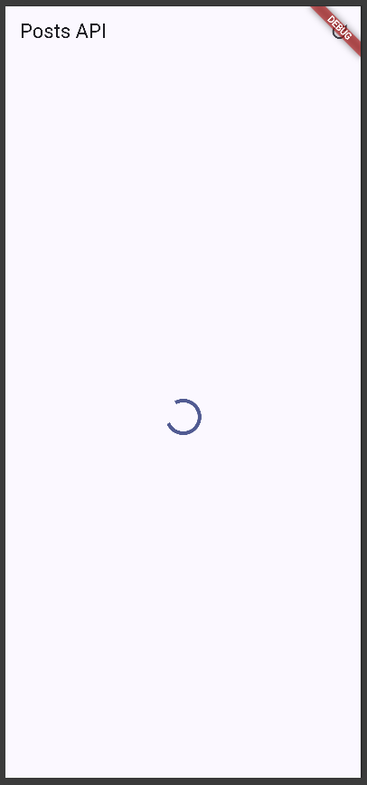

    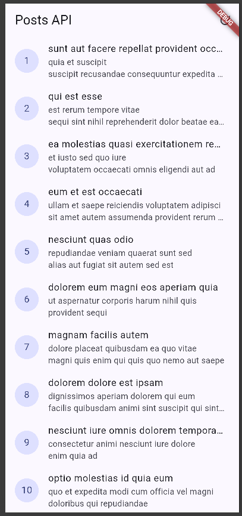

2. Matikan internet (mode pesawat), tekan refresh, amati pesan ramah + tombol Coba lagi. Nyalakan kembali internet, tekan Coba lagi.

    Ketika koneksi internet dimatikan dan tombol refresh ditekan, aplikasi akan mencoba mengambil ulang data dari server. Karena tidak terdapat koneksi internet, proses tersebut gagal dan aplikasi menampilkan pesan yang lebih mudah dipahami oleh pengguna, yaitu "Tidak dapat terhubung dengan server. Periksa internet anda", serta menyediakan tombol Coba lagi.

    Setelah koneksi internet dinyalakan kembali dan tombol Coba lagi ditekan, ref.invalidate(postListProvider) akan menjalankan ulang provider sehingga aplikasi mencoba mengambil data kembali. Apabila koneksi telah kembali normal, daftar post akan berhasil ditampilkan kembali.

    

3. Sementara ubah baseUrl menjadi URL salah, amati pesan error koneksi. Kembalikan setelah uji.

    ada pengujian ini, baseUrl yang sebelumnya mengarah ke server JSONPlaceholder diubah sementara menjadi URL yang salah. Hal tersebut menyebabkan aplikasi tidak dapat terhubung ke server sehingga DioException ditangani oleh fungsi friendlyErrorMessage() dan aplikasi menampilkan pesan error koneksi yang lebih mudah dipahami pengguna.

    Setelah pengujian selesai, baseUrl dikembalikan ke URL yang benar agar aplikasi dapat kembali terhubung ke API dan mengambil data post seperti semula.

    Kode Program
    ```dart
    import 'package:dio/dio.dart';
    Dio createDio() {
    final dio = Dio(
        BaseOptions(
        baseUrl: 'https://jsonplaceholder-salah.typicode.com',
        connectTimeout: const Duration(seconds: 10),
        receiveTimeout: const Duration(seconds: 10),
        headers: {'Accept': 'application/json'},
        ),
    );
    dio.interceptors.add(
        LogInterceptor(requestBody: true, responseBody: false),
    );
    return dio;
    }
    ```

    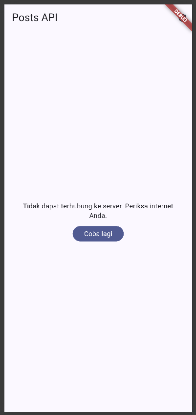 


---

## Praktikum 3: Pagination dasar

Membuat repositori paginated

Membuat notifier dengan state halaman

Membuat UI infinite Scroll

Berikut merupakan tampilan ketika diterapkan pagination.

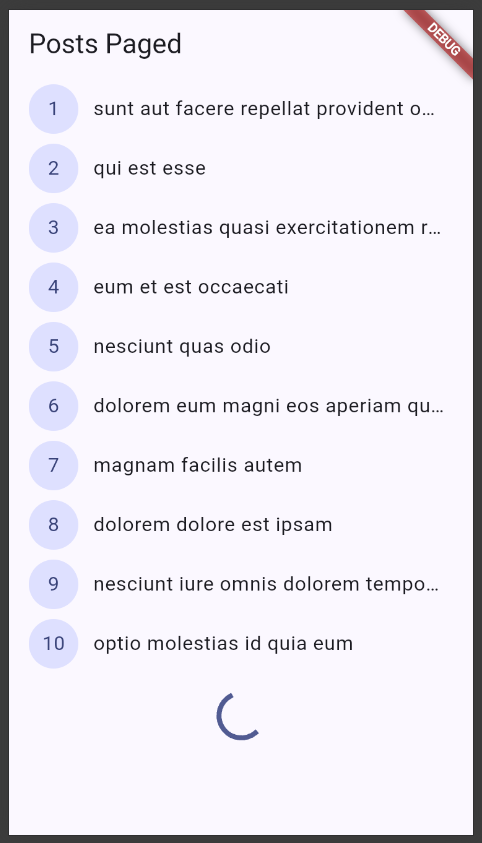

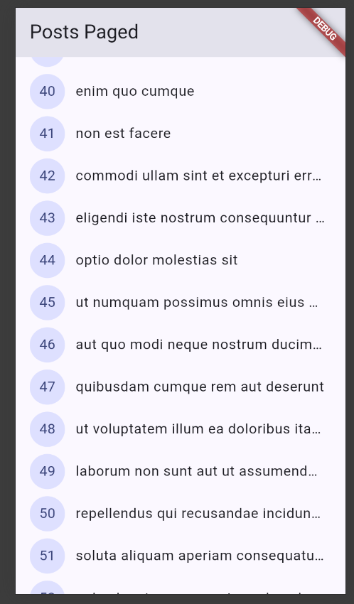

Terlihat pada aplikasi yakni pagination telah diterapkan dengan bukti bahwa ketika sebelum discroll hingga batas bawah, maka aplikasi tidka memunculkan 10 item berikutnya, dan hanya menampilkan indikator loading. Setelah discroll hingga batas bawah, maka aplikasi memunculkan 10 item berikutnya.

---

## AI Challenge

1. Agent yang dipakai: ChatGPT

2. Prompt yang digunakan:

    ```text
    Buatkan repository layer Flutter untuk endpoint GET /comments?postId={id}
    dari JSONPlaceholder menggunakan Dio + flutter_riverpod.
    Requirements:
    - Model Comment dengan fromJson aman null (postId, id, name, email, body).
    - CommentRepository dengan method fetchComments(postId) + timeout 10 detik.
    - AsyncNotifierProvider dengan penanganan error otomatis (AsyncError)
      dan fungsi pesan error
      ramah pengguna untuk timeout, connection error, 404, dan 500.
    - Satu unit test untuk fromJson dengan field yang hilang.
    Jelaskan setiap bagian kode dalam komentar.
    ```

3. Output awal AI:

    - providers.dart

        ```dart
        import 'package:dio/dio.dart';
        import 'package:flutter_riverpod/flutter_riverpod.dart';
        import 'dart:async';
        import 'api_client.dart';
        import 'models/comment.dart';
        import 'models/post.dart';
        import 'repositories/comment_repository.dart';
        import 'repositories/post_repository.dart';

        final dioProvider = Provider<Dio>((ref) => createDio());

        final postRepositoryProvider = Provider<PostRepository>(
          (ref) => PostRepository(ref.watch(dioProvider)),
        );

        // Repository di-inject melalui provider agar mudah diganti dengan mock saat test.
        final commentRepositoryProvider = Provider<CommentRepository>(
          (ref) => CommentRepository(ref.watch(dioProvider)),
        );

        // Notifier menerima postId dari family sehingga tiap postId punya state sendiri.
        class CommentsNotifier extends AsyncNotifier<List<Comment>> {
          CommentsNotifier(this.postId);

          final int postId;

          // Exception dibiarkan naik agar Riverpod membentuk AsyncError otomatis.
          @override
          Future<List<Comment>> build() {
            return ref.watch(commentRepositoryProvider).fetchComments(postId);
          }

          // Memuat ulang komentar dan mempertahankan penanganan state async Riverpod.
          Future<void> refresh() async {
            state = const AsyncLoading();
            state = await AsyncValue.guard(
              () => ref.read(commentRepositoryProvider).fetchComments(postId),
            );
          }
        }

        // Family membuat instance dan state notifier terpisah untuk setiap postId.
        final commentsProvider = AsyncNotifierProvider.family<
            CommentsNotifier,
            List<Comment>,
            int>(
          CommentsNotifier.new,
        );

        class PostListNotifier extends AsyncNotifier<List<Post>> {
          @override
          Future<List<Post>> build() async {
            final repository = ref.watch(postRepositoryProvider);
            return repository.fetchPosts();
          }

          Future<void> refresh() async {
            state = const AsyncLoading();

            try {
              final repository = ref.read(postRepositoryProvider);
              state = AsyncData(await repository.fetchPosts());
            } catch (e, st) {
              state = AsyncError(e, st);
            }
          }
        }

        final postListProvider =
            AsyncNotifierProvider<PostListNotifier, List<Post>>(
          PostListNotifier.new,
          retry: (retryCount, error) => null,
        );

        Future<List<Post>> readPostsOnce(ProviderContainer container) {
          final completer = Completer<List<Post>>();

          final sub = container.listen<AsyncValue<List<Post>>>(
            postListProvider,
            (previous, next) {
              if (next.isLoading || completer.isCompleted) return;

              next.whenData(completer.complete);

              if (next.hasError) {
                completer.completeError(
                  next.error ?? StateError('unknown error'),
                  next.stackTrace ?? StackTrace.empty,
                );
              }
            },
            fireImmediately: true,
          );

          return completer.future.whenComplete(sub.close);
        }

        Future<Object?> readPostsErrorOnce(ProviderContainer container) {
          final completer = Completer<Object?>();

          final sub = container.listen<AsyncValue<List<Post>>>(
            postListProvider,
            (previous, next) {
              if (next.isLoading || completer.isCompleted) return;
              completer.complete(next.error);
            },
            fireImmediately: true,
          );

          return completer.future.whenComplete(sub.close);
        }

        String friendlyErrorMessage(Object error) {
          if (error is DioException) {
            switch (error.type) {
              case DioExceptionType.connectionTimeout:
              case DioExceptionType.sendTimeout:
              case DioExceptionType.receiveTimeout:
                return 'Koneksi lambat. Periksa internet anda';

              case DioExceptionType.connectionError:
                return 'Tidak dapat terhubung dengan server. Periksa internet anda';

              case DioExceptionType.badResponse:
                final code = error.response?.statusCode;

                if (code == 404) {
                  return 'Data tidak ditemukan (404)';
                }

                if (code == 401 || code == 403) {
                  return 'Akses ditolak ($code). Periksa kredensial anda.';
                }

                return 'Server bermasalah ($code). Coba lagi nanti';

              default:
                return 'Terjadi kesalahan jaringan. Coba lagi';
            }
          }

          return 'Terjadi kesalahan tak terduga';
        }

        /// Mengubah error jaringan menjadi pesan yang dapat dipahami pengguna.
        String commentErrorMessage(Object error) {
          if (error is DioException) {
            switch (error.type) {
              case DioExceptionType.connectionTimeout:
              case DioExceptionType.sendTimeout:
              case DioExceptionType.receiveTimeout:
                return 'Permintaan terlalu lama. Periksa koneksi internet lalu coba lagi.';

              case DioExceptionType.connectionError:
                return 'Tidak dapat terhubung ke server. Periksa koneksi internet Anda.';

              case DioExceptionType.badResponse:
                switch (error.response?.statusCode) {
                  case 404:
                    return 'Komentar tidak ditemukan.';
                  case 500:
                    return 'Server sedang bermasalah. Coba lagi nanti.';
                  default:
                    return 'Server mengembalikan error. Coba lagi nanti.';
                }

              default:
                return 'Terjadi kesalahan jaringan. Coba lagi.';
            }
          }

          return 'Terjadi kesalahan tak terduga. Coba lagi.';
        }
        ```

    - comment.dart

        ```dart
        /// Merepresentasikan satu komentar dari endpoint JSONPlaceholder.
        class Comment {
          const Comment({
            required this.postId,
            required this.id,
            required this.name,
            required this.email,
            required this.body,
          });

          final int postId;
          final int id;
          final String name;
          final String email;
          final String body;

          /// Membaca JSON dengan fallback aman agar field null atau hilang
          /// tidak menyebabkan cast error saat response tidak lengkap.
          factory Comment.fromJson(Map<String, dynamic> json) {
            return Comment(
              postId: (json['postId'] as num?)?.toInt() ?? 0,
              id: (json['id'] as num?)?.toInt() ?? 0,
              name: json['name'] as String? ?? '',
              email: json['email'] as String? ?? '',
              body: json['body'] as String? ?? '',
            );
          }
        }
        ```

    - comment_repository.dart

        ```dart
        import 'package:dio/dio.dart';

        import '../models/comment.dart';

        /// Menyediakan akses khusus untuk endpoint komentar.
        class CommentRepository {
          CommentRepository(this._dio);

          final Dio _dio;

          /// Mengambil komentar untuk post tertentu dengan batas waktu 10 detik.
          Future<List<Comment>> fetchComments(int postId) async {
            final response = await _dio.get<List<dynamic>>(
              '/comments',
              queryParameters: {'postId': postId},
              options: Options(
                connectTimeout: const Duration(seconds: 10),
                sendTimeout: const Duration(seconds: 10),
                receiveTimeout: const Duration(seconds: 10),
              ),
            );

            // Hanya item berbentuk object yang dipetakan agar response yang tidak
            // sesuai kontrak tidak membuat seluruh parsing gagal.
            return (response.data ?? [])
                .whereType<Map<String, dynamic>>()
                .map(Comment.fromJson)
                .toList();
          }
        }
        ```

    - comment_test.dart

        ```dart
        import 'package:flutter_test/flutter_test.dart';
        import 'package:week4_api/data/models/comment.dart';

        void main() {
          test('Comment.fromJson memakai nilai default saat field hilang', () {
            // Map kosong mensimulasikan response JSON yang tidak lengkap.
            final comment = Comment.fromJson({});

            // Semua field tetap valid dan tidak menghasilkan exception cast/null.
            expect(comment.postId, 0);
            expect(comment.id, 0);
            expect(comment.name, '');
            expect(comment.email, '');
            expect(comment.body, '');
          });
        }
        ```

    Berikut merupakan tampilan aplikasi setelah implementasi kode hasil bantuan ChatGPT.

    

4. AI Verification Checklist

    a. Apakah UI memanggil Dio secara langsung (dilarang) atau lewat repository?

        UI tidak memanggil Dio secara langsung. Proses pengambilan data dilakukan melalui repository yang kemudian diakses menggunakan provider. Pada CommentsNotifier, data komentar diperoleh melalui commentRepositoryProvider, sedangkan data post diperoleh melalui postRepositoryProvider. Dengan demikian, pemisahan antara UI, state management, dan proses akses API sudah diterapkan dengan baik.

    b. Apakah fromJson aman null, atau masih memakai cast langsung yang bisa crash?

        Method Comment.fromJson() sudah cukup aman terhadap nilai null atau field yang hilang karena menggunakan nullable cast dan memberikan nilai default menggunakan operator ??. Field angka akan menggunakan nilai 0, sedangkan field String akan menggunakan string kosong apabila data tidak tersedia.

    c. Apakah semua tipe DioExceptionType (timeout, connectionError, badResponse) dipetakan ke pesan pengguna?

        Ya. Fungsi commentErrorMessage() telah menangani connectionTimeout, sendTimeout, dan receiveTimeout sebagai kondisi timeout. Selain itu, connectionError juga memiliki pesan tersendiri dan badResponse ditangani berdasarkan status HTTP, termasuk 404 dan 500. Error jaringan lainnya ditangani melalui bagian default. Dengan demikian, tipe error utama yang diminta sudah diterjemahkan menjadi pesan yang lebih mudah dipahami pengguna.

    d. Apakah baseUrl/timeout terpusat di satu client, bukan tersebar di tiap method?

        Belum sepenuhnya. baseUrl, connectTimeout, dan receiveTimeout sebenarnya sudah didefinisikan pada BaseOptions di api_client.dart, sehingga konfigurasi dasar Dio sudah dipusatkan.

        Namun, pada CommentRepository.fetchComments(), AI kembali mendefinisikan connectTimeout, sendTimeout, dan receiveTimeout masing-masing sebesar 10 detik melalui Options. Artinya konfigurasi timeout masih tersebar dan terjadi duplikasi konfigurasi.

        Berikut merupakan perbaikan kode programnya.

        - api_client.dart

            ```dart
            import 'package:dio/dio.dart';

            Dio createDio() {
              final dio = Dio(
                BaseOptions(
                  baseUrl: 'https://jsonplaceholder.typicode.com',
                  connectTimeout: const Duration(seconds: 10),
                  sendTimeout: const Duration(seconds: 10),
                  receiveTimeout: const Duration(seconds: 10),
                  headers: {'Accept': 'application/json'},
                ),
              );

              dio.interceptors.add(
                LogInterceptor(
                  requestBody: true,
                  responseBody: false,
                ),
              );

              return dio;
            }
            ```

        - comment_repository.dart

            ```dart
            import 'package:dio/dio.dart';

            import '../models/comment.dart';

            /// Menyediakan akses khusus untuk endpoint komentar.
            class CommentRepository {
              CommentRepository(this._dio);

              final Dio _dio;

              /// Mengambil komentar untuk post tertentu.
              Future<List<Comment>> fetchComments(int postId) async {
                final response = await _dio.get<List<dynamic>>(
                  '/comments',
                  queryParameters: {'postId': postId},
                );

                // Hanya item berbentuk object yang dipetakan agar response yang tidak
                // sesuai kontrak tidak membuat seluruh parsing gagal.
                return (response.data ?? [])
                    .whereType<Map<String, dynamic>>()
                    .map(Comment.fromJson)
                    .toList();
              }
            }
            ```

    e. Apakah test AI benar-benar menguji kasus field hilang, atau hanya happy path? Tambahkan minimal 1 edge case sendiri.

        Test yang dibuat AI benar-benar menguji field yang hilang, bukan hanya happy path. Hal tersebut dilakukan dengan memberikan map kosong {} kepada Comment.fromJson() dan kemudian memastikan seluruh field memperoleh nilai default.

        Berikut merupakan penambahan kode programnya.

        ```dart
        import 'package:flutter_test/flutter_test.dart';
        import 'package:week4_api/data/models/comment.dart';

        void main() {
          group('Comment.fromJson', () {
            test('menggunakan nilai default ketika field hilang', () {
              final json = <String, dynamic>{
                'postId': 1,
                'id': 2,
              };

              final comment = Comment.fromJson(json);

              expect(comment.postId, 1);
              expect(comment.id, 2);
              expect(comment.name, '');
              expect(comment.email, '');
              expect(comment.body, '');
            });

            test('menggunakan nilai default ketika semua field null', () {
              final json = <String, dynamic>{
                'postId': null,
                'id': null,
                'name': null,
                'email': null,
                'body': null,
              };

              final comment = Comment.fromJson(json);

              expect(comment.postId, 0);
              expect(comment.id, 0);
              expect(comment.name, '');
              expect(comment.email, '');
              expect(comment.body, '');
            });
          });
        }
        ```

    f. Jalankan flutter analyze dan flutter test, apakah hasil AI lolos tanpa warning?

        Berikut merupakan hasil flutter test setelah dilakukan pengujian:

        ```text
        +2: All tests passed!
        ```

    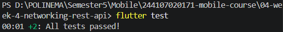

        Terlihat pada hasil tersebut bahwa seluruh unit test berhasil dijalankan.

        Selanjutnya dilakukan pemeriksaan kode menggunakan flutter analyze.

        ```text
        No issues found!
        ```

    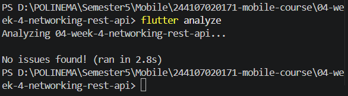

        Berdasarkan hasil akhir tersebut, project berhasil melewati flutter analyze tanpa error maupun warning.

---

## Refactor & Testing

1. Ekstrak widget baris post menjadi PostTile tersendiri agar ListView.builder pendek dan mudah diuji.

    Perubahan kode program dilakukan dengan menambahkan folder `widgets` dan file baru `post_tile.dart`. Widget `PostTile` digunakan untuk menampilkan setiap item post sehingga kode pada `ListView.builder` menjadi lebih pendek dan dapat digunakan kembali pada halaman lain.

    `PostTile` juga memiliki parameter `onTap` yang digunakan untuk membuka halaman detail post ketika salah satu item ditekan.

    Berikut merupakan tampilan awal untuk aplikasi saat ini.

    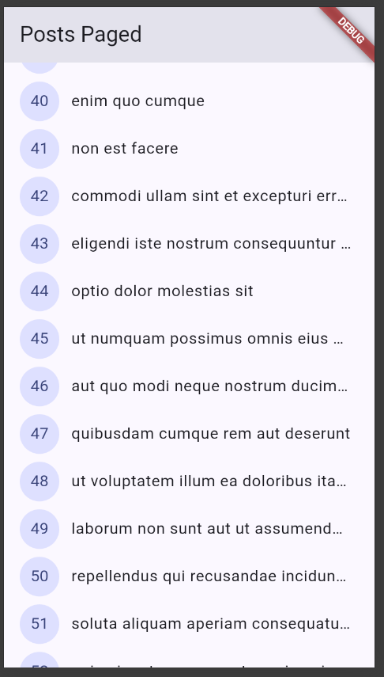

2. Pindahkan friendlyErrorMessage ke file lib/data/network_errors.dart agar bisa dipakai ulang halaman paged dan non-paged.

    Fungsi `friendlyErrorMessage()` yang sebelumnya berada pada `providers.dart` dipindahkan ke file baru `lib/data/network_errors.dart`. Fungsi tersebut bertugas mengubah error dari Dio, seperti timeout, connection error, maupun HTTP error, menjadi pesan yang lebih mudah dipahami oleh pengguna.

    Pemisahan ini dilakukan agar logika penanganan error tidak bercampur dengan konfigurasi provider dan dapat digunakan kembali oleh berbagai bagian aplikasi. Halaman paged maupun non-paged dapat menggunakan fungsi `friendlyErrorMessage()` yang sama tanpa mendefinisikan logika penanganan error secara berulang.

    Perubahan ini tidak menghasilkan perubahan tampilan aplikasi secara langsung karena hanya melakukan restrukturisasi pada kode penanganan error.

3. Tambahkan halaman detail post dengan GoRouter (`/post/:id`) yang menampilkan title dan body lengkap.

    Navigasi aplikasi direfactor menggunakan GoRouter dengan menambahkan route `/post/:id`. Setiap `PostTile` dapat ditekan untuk membuka halaman detail sesuai dengan ID post yang dipilih.

    Pada `PostRepository` ditambahkan method `fetchPostById()` untuk mengambil satu post berdasarkan ID. Kemudian dibuat `postDetailProvider` menggunakan `AsyncNotifierProvider.family` untuk mengelola state loading, error, dan data pada halaman detail.

    Ketika pengguna membuka detail post, ID dari route `/post/:id` diteruskan ke `PostDetailPage`. Selanjutnya `postDetailProvider(postId)` mengambil data post berdasarkan ID melalui `PostRepository`. Halaman detail kemudian menampilkan `title` dan `body` post secara lengkap.

    Dengan penggunaan route berdasarkan ID, halaman detail juga tetap dapat mengambil data melalui repository ketika route detail dibuka secara langsung.

    Berikut merupakan tampilan awal aplikasi.

    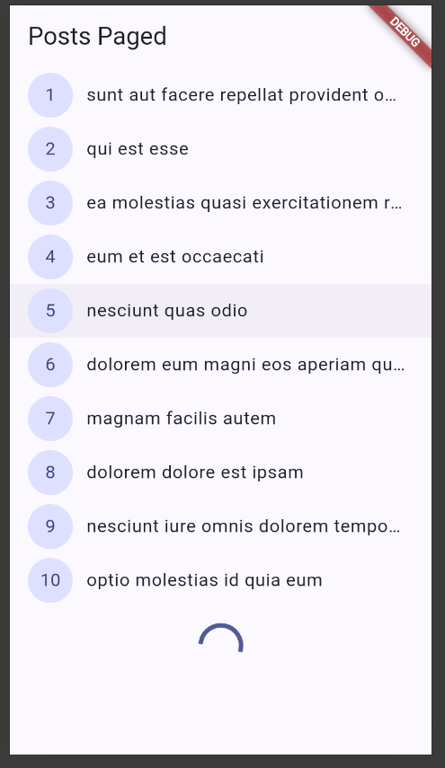

    Dan berikut merupakan tampilan aplikasi setelah salah satu item post ditekan untuk menuju halaman detail.

    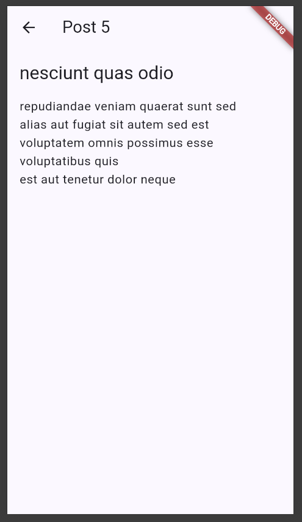

Berikut merupakan bukti untuk testing flutter test dan flutter analyze

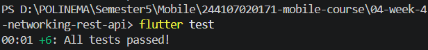

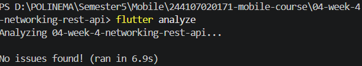

Berdasarkan hasil tersebut, seluruh test berhasil dijalankan dan project tidak memiliki error maupun warning berdasarkan hasil `flutter analyze`.

---

## Mini Project

1. Ambil data dari API dummy (JSONPlaceholder /posts atau API publik lain tanpa key). Tampilkan ke UI melalui repository + Riverpod.

2. Terapkan Dio terpusat (base URL, timeout, interceptor logging) dan model fromJson aman null.

3. Tampilkan keempat state: loading, error (+ tombol retry), empty, success.

4. Tambahkan pagination dasar (infinite scroll, 10 item per halaman) dengan guard request ganda.

5. Sertakan minimal 2 test yang lulus (1 unit test model/error mapping + 1 test provider dengan repository palsu).

6. Kerjakan bagian AI Challenge dan dokumentasikan prompt, hasil AI, perbaikan, serta alasan keputusan teknis Anda di docs/.

7. Push ke repository portfolio pada folder 04-week-4-networking-rest-api/ dengan struktur lib/, test/, docs/, README.md, dan screenshots/. README menjelaskan tujuan, fitur utama, stack teknologi, cara menjalankan, dan hasil yang dicapai.

---

## Refleksi

1. Mengapa UI dilarang memanggil Dio langsung? Apa yang rusak jika aturan ini dilanggar?

    Jawaban: UI tidak seharusnya memanggil Dio secara langsung karena UI bertanggung jawab untuk menampilkan data dan menerima interaksi pengguna, sedangkan proses pengambilan data dari API merupakan tanggung jawab repository. Pada aplikasi ini, UI memperoleh state melalui Riverpod Provider, kemudian Provider menggunakan PostRepository atau CommentRepository untuk mengakses API melalui Dio. Jika Dio dipanggil langsung dari UI, kode tampilan akan bercampur dengan logika akses data. Akibatnya kode menjadi lebih sulit dipelihara, digunakan kembali, dan diuji. Pengujian juga menjadi lebih sulit karena widget akan bergantung langsung pada koneksi internet. Dengan repository, repository asli dapat diganti dengan FakePostRepository saat testing sehingga pengujian dapat dilakukan tanpa internet.

2. Kapan pagination client-side cukup, dan kapan harus mengandalkan pagination server (_page/_limit)?

    Jawaban: Pagination client-side cukup digunakan apabila jumlah data relatif sedikit dan seluruh data masih aman untuk diambil sekaligus. Data dapat dimuat satu kali dari server kemudian dibagi menjadi beberapa bagian pada aplikasi. Cara ini sederhana, tetapi menjadi kurang efisien ketika jumlah data sangat banyak karena seluruh data tetap harus dikirim dan disimpan pada perangkat. Pagination server-side lebih sesuai untuk jumlah data yang besar. Aplikasi hanya meminta data yang sedang diperlukan menggunakan parameter seperti _page dan _limit.

3. Bagaimana exception repository berubah menjadi AsyncError tanpa try/catch di setiap widget? Kapan try/catch eksplisit tetap dibutuhkan?

    Jawaban: Riverpod dapat menangani exception dari proses asynchronous melalui AsyncNotifier atau provider asynchronous. Apabila repository melempar exception, misalnya DioException, exception tersebut dapat diteruskan oleh Provider dan direpresentasikan sebagai AsyncError. Oleh karena itu, widget tidak perlu melakukan try/catch sendiri dan cukup menangani state melalui AsyncValue. try/catch eksplisit tetap diperlukan apabila aplikasi membutuhkan tindakan khusus ketika terjadi error, misalnya mempertahankan data lama ketika pagination gagal, mengubah state tertentu, melakukan logging, atau menjalankan proses tambahan. Contohnya terdapat pada loadNextPage(), di mana data post yang sudah berhasil dimuat perlu tetap dipertahankan walaupun request halaman berikutnya mengalami kegagalan.

4. Bagian mana dari hasil AI yang Anda perbaiki, dan mengapa?

    Jawaban: Hasil AI tidak digunakan secara langsung tanpa verifikasi. Beberapa bagian diperbaiki agar sesuai dengan struktur dan kebutuhan aplikasi. Pertama, konfigurasi timeout yang awalnya diletakkan pada pemanggilan repository dipindahkan ke api_client.dart agar konfigurasi Dio seperti baseUrl, connectTimeout, sendTimeout, dan receiveTimeout berada pada satu tempat.

    Kedua, fungsi friendlyErrorMessage() dipisahkan dari providers.dart ke network_errors.dart agar penanganan error dapat digunakan kembali oleh halaman paged maupun non-paged. Ketiga, helper pengujian disesuaikan dari readPostOnce() menjadi readPostsOnce() agar sesuai dengan kode test yang digunakan. Pengujian model dari AI yang hanya memeriksa field yang hilang juga dilengkapi dengan pengujian terhadap field bernilai null.

---

## Kesimpulan 

Pada Week 4, dipelajari integrasi REST API pada Flutter menggunakan Dio, Riverpod, dan repository pattern. Selain itu, diterapkan error handling, pagination, navigasi detail dengan GoRouter, refactoring, serta testing menggunakan fake repository. Seluruh pengujian berhasil dan project lolos flutter analyze tanpa error maupun warning.