# 05-week-5-local-storage-offline-first

## Tujuan 

1. Menjelaskan perbedaan penyimpanan key-value, relasional, dan NoSQL di perangkat.
2. Menyimpan preferensi sederhana (tema, terakhir dibuka) dengan SharedPreferences.
3. Menerapkan CRUD catatan dengan SQLite (sqflite) melalui repository lokal.
4. Menerapkan pola offline-first: cache-first read, dirty flag, dan antrean sinkronisasi.
5. Menampilkan state loading, error, empty, dan success untuk data lokal dengan Riverpod.
6. Menguji repository lokal dengan repository palsu (tanpa database sungguhan).

---

## Praktikum 1: SharedPreferences

Membuat repository preferensi untuk menyimpan akses key-value terpusat.

Membuat provider dan halaman pengaturan.

Berikut merupakan contoh bukti tampilan aplikasi untuk page setting untuk tema terang.

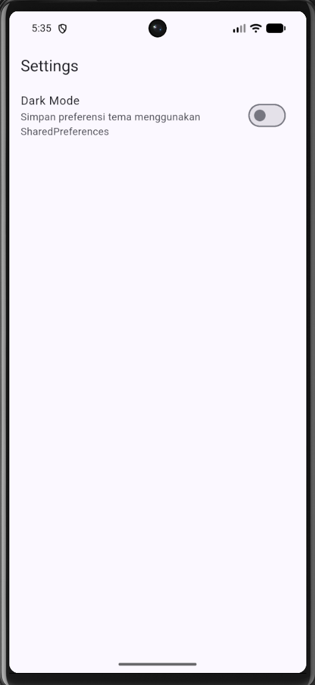

Dan berikut merupakan untuk tampilan gelapnya.

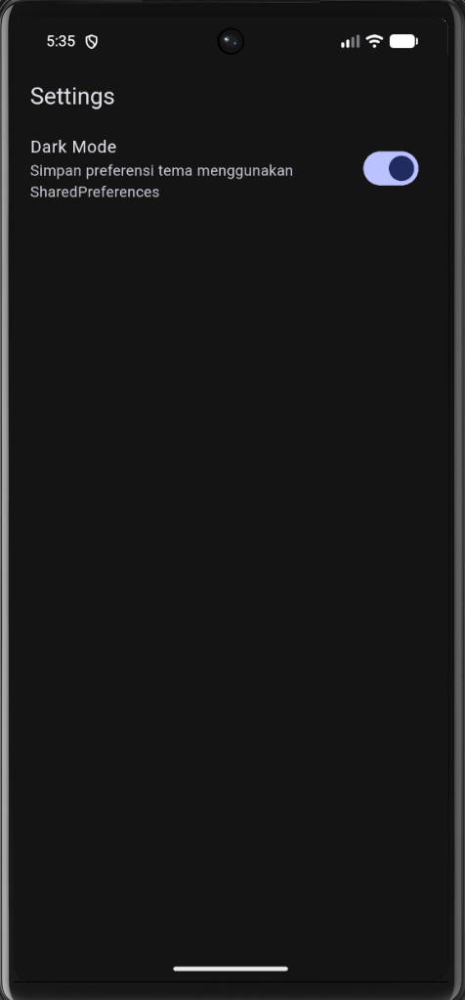

Setelah dilakukan hot restart, maka tampilan aplikasi akan tetap pada mode dark karena digunakan shared preferences.

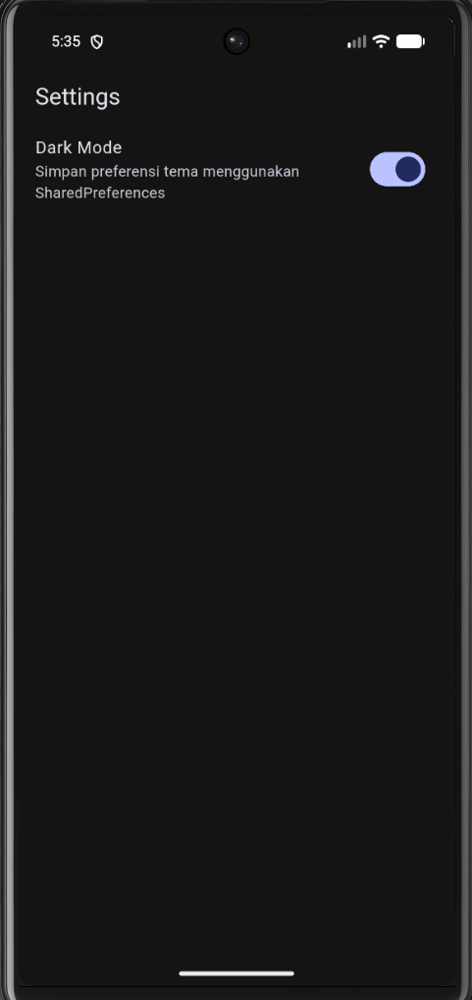

---

## Praktikum 2: SQLite dan repository catatan

Membuat model catatan.

Membuat pembuka database pada db.dart.

Membuat repository sebagai satu-satunya pintu akses data yang terdapat
pada note_repository.dart.

Membuat halaman catatan offline yang mengambil data melalui
notesProvider dan NoteRepository.

Berikut merupakan tampilan catatan yang telah tersimpan pada SQLite.

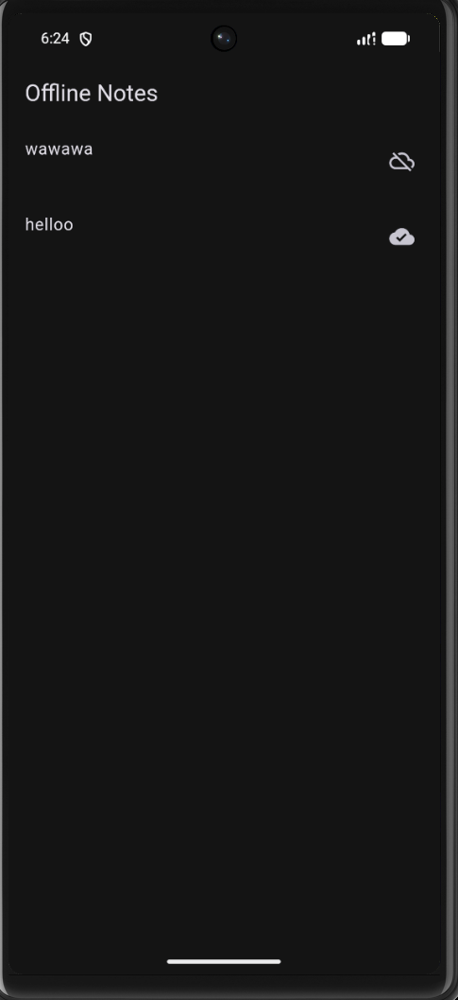

Catatan yang sebelumnya ditambahkan tetap tersimpan dan dapat
ditampilkan kembali karena data disimpan pada SQLite melalui
NoteRepository.

---

## Praktikum 3: Cache-first dan antrean sync

Menggunakan endpoint minggu 4 GET /posts untuk JSON placeholder

Berikut merupakan tampilan catatan setelah diambil data melalui API GET /posts pertama kali, namun tidak terhubung dengan internet.

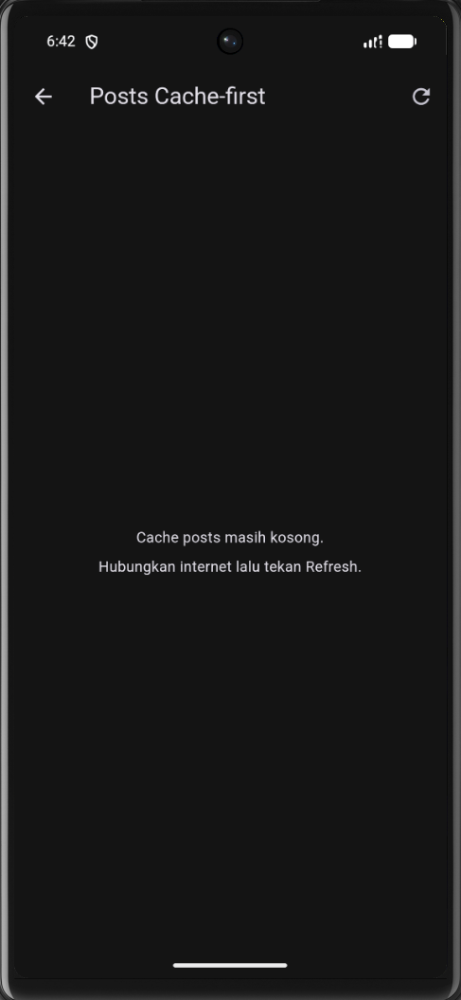

Berikut merupakan tampilannya ketika ditekan refresh dan terhubung dengan internet.

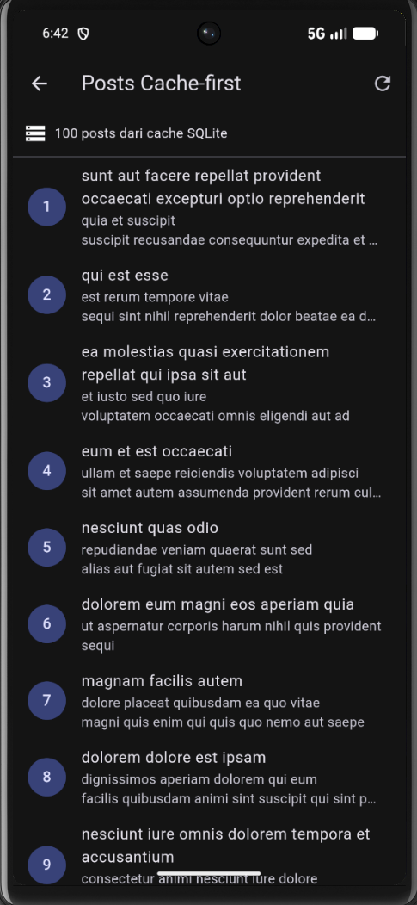

List tersebut tetap tersimpan di SQLite meskipun tidak terhubung dengan internet, dan ketika dilakukan hot restart pada aplikasi nya.

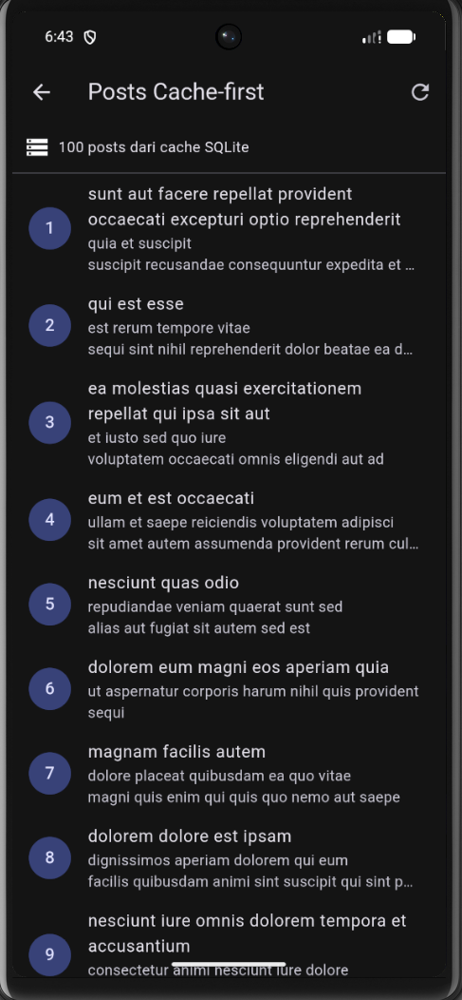

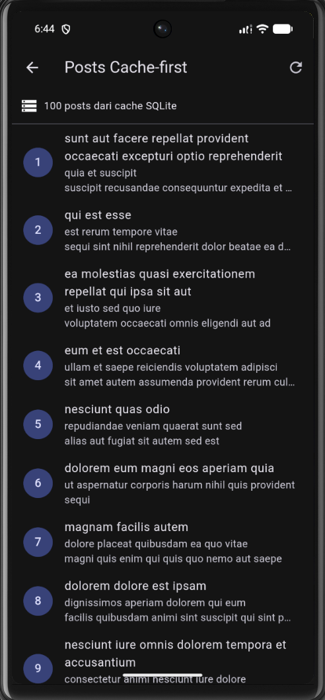


Menyinkronisasikan catatan kotor (dirty) 

Berikut merupakan tampilan badge dirty notes beserta jumlah yang masih dirty.

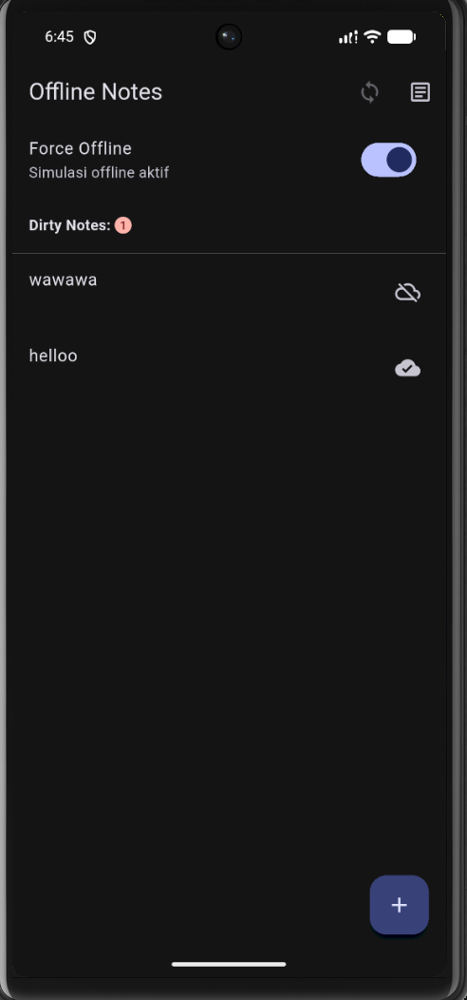

Berikut merupakan tampilannya setelah dilakukan sync.

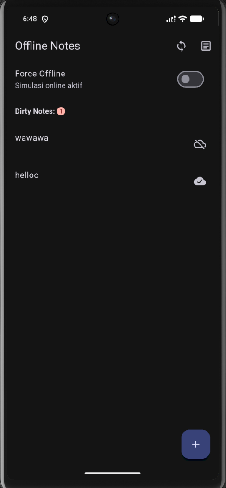


Simulasi offline deterministik

Berikut merupakan tampilan ketika force offline dimatikan.

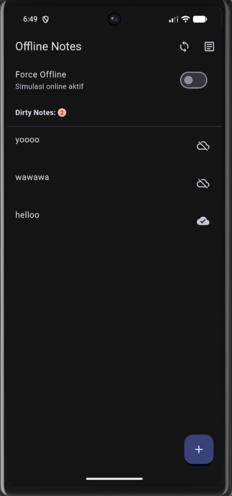

Berikut merupakan tampilan ketika force offline dinyalakan.

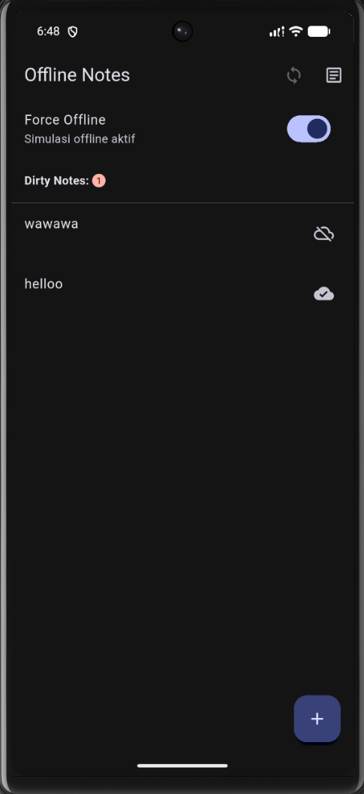

Berikut tampilan ketika dilakukan penambahan notes sebelum sync (Force offline mati).

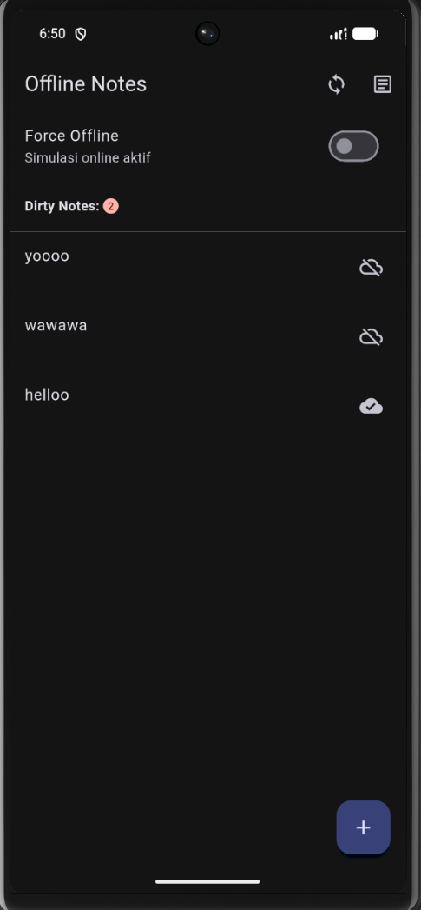

Dan berikut merupakan tampilan ketika force Offline dimatikan dan dilakukan sync.

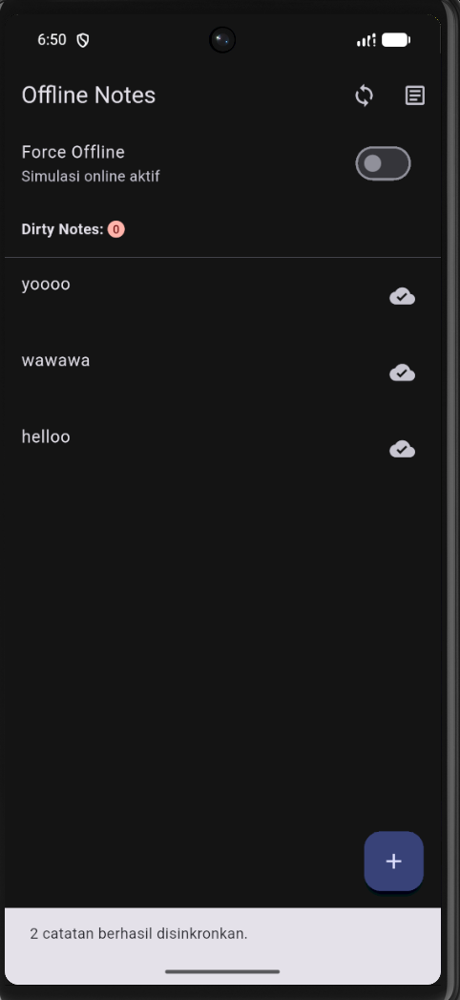

Saat Force Offline diaktifkan, catatan yang telah tersimpan tetap dapat ditampilkan dan catatan baru dapat disimpan ke SQLite dengan status dirty. Setelah koneksi disimulasikan kembali online dan proses sinkronisasi dijalankan, nilai dirty berubah dari 2 menjadi 0.

---

## AI Challenge

### 1. Agent yang Dipakai

ChatGPT (GPT-5.6 Sol)

### 2. Prompt yang Digunakan

Aplikasi Flutter Offline Notes: CRUD catatan + preferensi tema.
Bandingkan SharedPreferences, Hive, sqflite (SQLite), dan Drift
untuk dua kebutuhan ini. Requirements:
- Kriteria: kompleksitas query, kebutuhan relasi, reaktivitas (stream),
  type-safety, ukuran boilerplate, dan kemudahan testing.
- Beri rekomendasi final: mana untuk preferensi, mana untuk catatan,
  beserta alasannya dalam 1 tabel.
- Tunjukkan skema tabel/kotak untuk 1000+ catatan.
Jelaskan trade-off setiap pilihan.

### 3. Output Awal AI

Aplikasi Offline Notes memiliki dua kebutuhan penyimpanan yang berbeda. Preferensi tema hanya menyimpan data sederhana seperti status dark mode, sedangkan catatan merupakan data terstruktur yang jumlahnya dapat terus bertambah dan membutuhkan operasi CRUD serta status sinkronisasi. Oleh karena itu, pemilihan penyimpanan sebaiknya disesuaikan dengan karakteristik masing-masing data.

| Kriteria | SharedPreferences | Hive | sqflite (SQLite) | Drift |
| --- | --- | --- | --- | --- |
| Kompleksitas query | Sangat sederhana karena berbasis key-value | Cukup sederhana untuk penyimpanan objek | Mendukung query SQL seperti `WHERE`, `ORDER BY`, dan agregasi | Mendukung query kompleks dengan API yang lebih terstruktur |
| Kebutuhan relasi | Tidak ditujukan untuk data berelasi | Relasi perlu dikelola secara manual | Mendukung tabel dan relasi database | Sangat baik untuk data relasional |
| Reaktivitas | Tidak menyediakan stream perubahan database secara bawaan | Dapat mengamati perubahan pada data/box | Query tidak menghasilkan stream secara bawaan | Mendukung reactive query, misalnya melalui `watch()` |
| Type-safety | Terbatas pada tipe data sederhana | Cukup baik, terutama dengan model yang terstruktur | Mapping hasil query ke model dilakukan secara manual | Tinggi karena tabel dan query dapat diperiksa melalui code generation |
| Boilerplate | Sangat sedikit | Rendah hingga sedang | Sedang karena membutuhkan database, model, mapping, dan repository | Relatif tinggi karena membutuhkan konfigurasi dan generated code |
| Kemudahan testing | Mudah untuk data preferensi sederhana | Relatif mudah | Baik jika akses database dipisahkan melalui repository atau dependency injection | Baik karena lapisan database dapat diuji secara terpisah |
| Kesesuaian preferensi tema | Sangat cocok | Bisa digunakan, tetapi tidak diperlukan | Terlalu kompleks | Terlalu kompleks |
| Kesesuaian catatan 1000+ | Tidak disarankan | Cukup cocok | Sangat cocok | Sangat cocok untuk kebutuhan yang lebih kompleks |

#### Rekomendasi

| Kebutuhan | Storage yang Dipilih | Alasan |
| --- | --- | --- |
| Preferensi tema | **SharedPreferences** | Preferensi seperti dark mode hanya membutuhkan penyimpanan key-value sederhana sehingga tidak memerlukan database relasional. |
| Catatan offline | **sqflite (SQLite)** | Catatan membutuhkan CRUD, pengurutan, penyimpanan banyak data, dan atribut sinkronisasi seperti `dirty` dan `updated_at`. SQLite dapat memenuhi kebutuhan tersebut tanpa kompleksitas tambahan seperti code generation. |

#### Trade-off

**SharedPreferences** unggul dari sisi kesederhanaan dan cocok untuk konfigurasi kecil. Namun, penyimpanan ini tidak ideal untuk daftar catatan karena tidak menyediakan mekanisme query dan pengelolaan koleksi seperti database.

**Hive** menawarkan penyimpanan lokal yang sederhana dan dapat menyimpan objek dengan cepat. Hive cocok apabila struktur data tidak terlalu kompleks, tetapi pengelolaan query dan hubungan antardata tidak sefleksibel database relasional.

**sqflite** memberikan akses langsung ke SQLite sehingga mendukung query, pengurutan, filter, transaksi, dan struktur tabel. Kekurangannya adalah developer harus menulis SQL serta melakukan mapping antara hasil query dan model Dart secara manual.

**Drift** memberikan abstraksi di atas SQLite dengan type-safety dan dukungan reactive query. Keunggulan tersebut juga membuat setup lebih kompleks karena terdapat definisi tabel, dependency tambahan, dan proses code generation. Untuk aplikasi Offline Notes pada praktikum ini, fitur tersebut belum menjadi kebutuhan utama.

#### Skema Penyimpanan 1000+ Catatan

Untuk jumlah catatan yang besar, setiap catatan disimpan sebagai satu baris pada tabel `notes`.

```text
┌───────────────────────────────────────┐
│                 notes                 │
├───────────────────────────────────────┤
│ id          INTEGER PRIMARY KEY       │
│             AUTOINCREMENT             │
│ title       TEXT NOT NULL             │
│ body        TEXT NOT NULL             │
│ updated_at  TEXT NOT NULL             │
│ dirty       INTEGER NOT NULL          │
└───────────────────────────────────────┘
```

Contoh struktur tabel:

```sql
CREATE TABLE notes(
  id INTEGER PRIMARY KEY AUTOINCREMENT,
  title TEXT NOT NULL,
  body TEXT NOT NULL DEFAULT '',
  updated_at TEXT NOT NULL,
  dirty INTEGER NOT NULL DEFAULT 0
);
```

Kolom `id` menjadi identitas unik setiap catatan. `title` dan `body` menyimpan isi catatan, sedangkan `updated_at` menyimpan waktu perubahan terakhir. Kolom `dirty` digunakan sebagai penanda apakah perubahan lokal masih menunggu proses sinkronisasi.

Dengan struktur tersebut, penambahan jumlah catatan tidak mengharuskan seluruh koleksi ditulis ulang. Data juga dapat diurutkan berdasarkan waktu perubahan menggunakan `updated_at`.

### 4. AI Verification Checklist

#### a. Apakah AI menempatkan daftar catatan di SharedPreferences?

Tidak. AI hanya merekomendasikan SharedPreferences untuk preferensi sederhana seperti dark mode. Rekomendasi ini diterima karena penyimpanan daftar catatan di SharedPreferences akan menyulitkan proses pencarian, pengurutan, pembaruan, dan pengelolaan data ketika jumlah catatan bertambah.

#### b. Apakah skema AI mendukung antrean sync (`dirty` / `updated_at`) atau hanya CRUD polos?

Ya. Skema yang diberikan memiliki kolom `dirty` dan `updated_at`. `dirty` dapat digunakan untuk mengetahui catatan yang masih memiliki perubahan lokal, sedangkan `updated_at` menyimpan waktu perubahan terakhir. Dengan demikian, struktur database tidak hanya mendukung CRUD tetapi juga sudah menyediakan informasi dasar untuk mekanisme sinkronisasi.

#### c. Apakah klaim "real-time" AI didukung stream (Drift/watch) atau hanya asumsi?

Klaim tersebut dapat diterima dengan catatan bahwa sqflite tidak memberikan reactive query berbasis stream secara langsung. Perubahan data pada implementasi sqflite perlu diteruskan kembali ke state aplikasi agar UI diperbarui. Drift memiliki dukungan yang lebih langsung terhadap reactive query melalui mekanisme seperti `watch()`.

#### d. Apakah estimasi boilerplate AI masuk akal setelah mencoba implementasinya?

Ya. Pada praktikum, penggunaan SharedPreferences relatif sederhana karena hanya membutuhkan repository untuk membaca dan menyimpan nilai berdasarkan key.

Implementasi sqflite membutuhkan lebih banyak bagian, yaitu pembukaan database, pembuatan tabel, model `Note`, konversi `toMap()` dan `fromMap()`, serta `NoteRepository`. Walaupun memiliki boilerplate lebih banyak daripada SharedPreferences, struktur tersebut masih sesuai dengan kebutuhan CRUD catatan dan penyimpanan offline.

Drift menawarkan abstraksi dan type-safety yang lebih tinggi, tetapi membutuhkan setup tambahan dan code generation. Untuk ruang lingkup aplikasi saat ini, tambahan kompleksitas tersebut belum diperlukan.

#### e. Keputusan Final

Saya memilih **SharedPreferences untuk preferensi tema** dan **sqflite (SQLite) untuk penyimpanan catatan**.

SharedPreferences dipilih karena data preferensi hanya berupa nilai sederhana sehingga penggunaan database akan menambah kompleksitas yang tidak diperlukan.

Sementara itu, sqflite dipilih karena catatan merupakan kumpulan data terstruktur yang membutuhkan CRUD, pengurutan, persistensi lokal, dan informasi untuk proses sinkronisasi. Penggunaan `dirty` dan `updated_at` juga sesuai dengan konsep offline-first yang diterapkan pada praktikum.

Kombinasi tersebut memberikan pembagian tanggung jawab yang jelas: SharedPreferences menangani konfigurasi aplikasi yang sederhana, sedangkan SQLite menangani data utama aplikasi yang lebih terstruktur dan dapat terus bertambah.

---

## Refactoring, Testing, dan error umum

1. Ekstrak baris catatan menjadi widget NoteTile tersendiri yang menampilkan badge "belum tersinkron" bila dirty == true.

    Berikut merupakan tampilan aplikasi ketika terdapat suatu note yang belum tersinkron.

    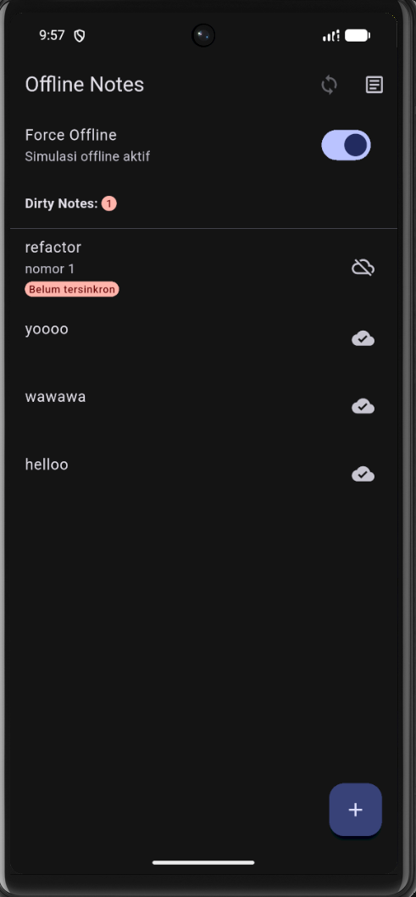

2. Pindahkan logika cache posts dan syncNotes ke file lib/data/sync.dart agar repository tetap fokus pada CRUD.

    Berikut merupakan tampilan Posts ketika data berhasil ditampilkan dari cache SQLite.

    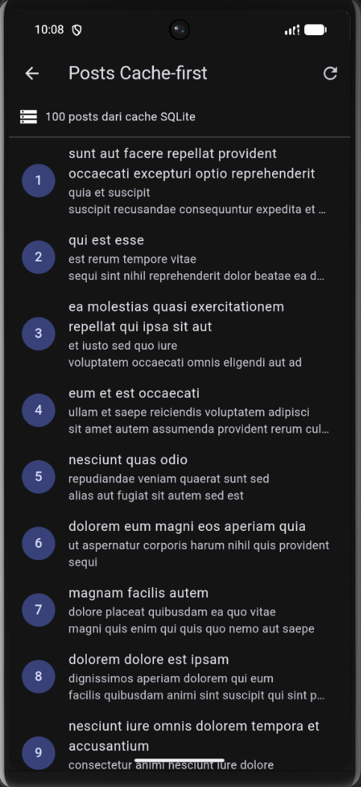

    Berikut merupakan tampilan proses sinkronisasi note yang sebelumnya memiliki status belum tersinkron.

    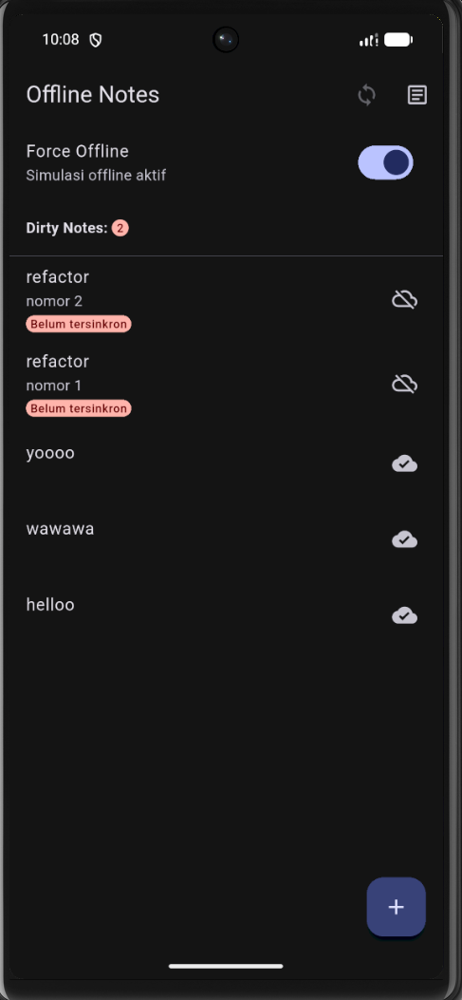

    Berikut merupakan tampilan aplikasi setelah proses sinkronisasi berhasil, ditandai dengan nilai Dirty Notes kembali menjadi 0.

    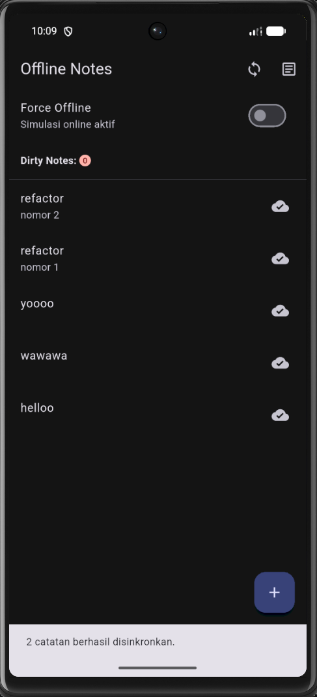


3. Tambahkan halaman detail catatan dengan GoRouter (/note/:id) yang membaca dari repository lokal, bukan dari state halaman list.

    Berikut merupakan tampilan detail untuk suatu notes dengan implementasi GoRouter.

    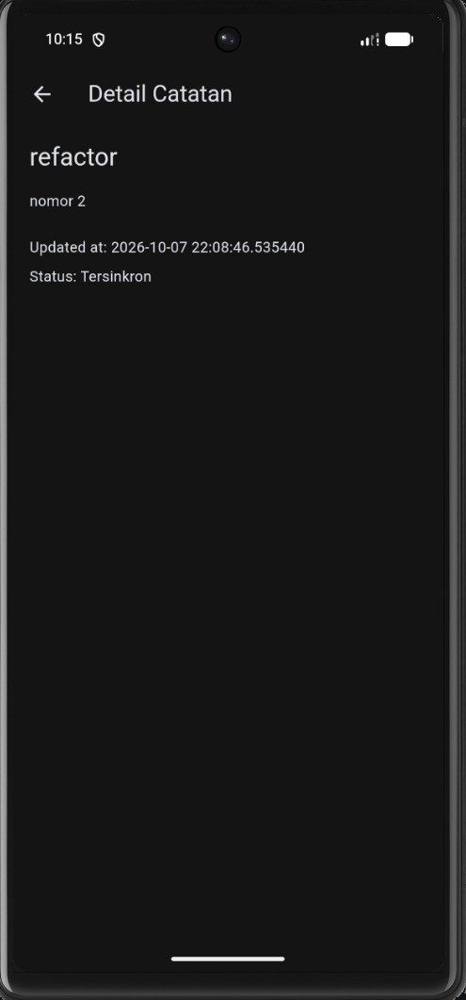

Berikut merupakan hasil testing yang telah dilakukan.

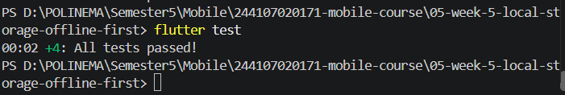

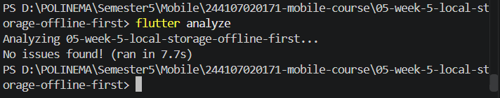

---

## Mini Project

1. Preferensi: toggle tema gelap/terang + waktu terakhir dibuka via SharedPreferences.
2. CRUD catatan persisten via SQLite (sqflite) melalui repository lokal + Riverpod; daftar diurutkan updated_at terbaru.
3. Offline-first: cache-first untuk data bacaan, dirty flag + syncNotes untuk tulisan, dan aturan konflik eksplisit yang didokumentasikan.
4. Buktikan mode pesawat: screenshot daftar catatan saat offline dan badge dirty sebelum/sesudah sync.
5. Sertakan minimal 2 test yang lulus (1 unit test model + 1 test provider dengan repository palsu).
6. Kerjakan bagian AI Challenge dan dokumentasikan prompt, tabel perbandingan storage, keputusan final, serta alasan teknis Anda di README.
7. Push ke repository portfolio pada folder 05-week-5-local-storage-offline-first/ dengan struktur lib/, test/, README.md, dan screenshots/. README menjelaskan tujuan, fitur utama, stack teknologi, cara menjalankan, dan hasil yang dicapai.

---

## Refleksi

1. Mengapa daftar catatan tidak boleh disimpan di SharedPreferences? Apa yang rusak jika aturan ini dilanggar?

    Jawaban: Karena SharedPreferences cocok untuk data key-value sederhana, bukan koleksi catatan. Jika dipaksakan, proses pencarian, update, filter, dan sinkronisasi banyak catatan menjadi sulit dan rapuh.

2. Kapan cache-first cukup, dan kapan Anda membutuhkan strategi lain (misalnya network-first untuk data harga real-time)?

    Jawaban: Cache-first cocok saat aplikasi harus tetap menampilkan data ketika offline dan data tidak harus selalu terbaru. Untuk data yang sangat cepat berubah, seperti harga real-time, lebih cocok network-first agar data terbaru diprioritaskan.

3. Bagaimana dirty flag berubah menjadi antrean sync tanpa memblokir UI? Kapan antrean terpisah (tabel outbox) menjadi perlu?

    Jawaban: Data yang berubah diberi dirty = true, lalu proses sync mengambil data dirty di background tanpa memblokir UI. Tabel outbox diperlukan jika operasi sync semakin kompleks, misalnya banyak operasi create, update, dan delete yang harus disimpan serta dikirim secara berurutan.

4. Bagian mana dari rekomendasi AI yang Anda tolak, dan mengapa?

    Jawaban: Saya menolak penambahan tabel tags dan note_tags karena aplikasi saat ini belum memiliki fitur tag. Untuk kebutuhan sekarang, tabel notes dengan updated_at dan dirty sudah cukup.

---

## Kesimpulan

Pada Week 5, telah dipelajari penerapan local storage dan konsep offline-first pada Flutter. SharedPreferences digunakan untuk menyimpan preferensi sederhana seperti tema aplikasi, sedangkan SQLite melalui sqflite digunakan untuk menyimpan catatan secara persisten.

Konsep offline-first diterapkan melalui cache-first untuk data posts serta dirty flag pada catatan yang belum tersinkronisasi. Aplikasi tetap dapat membaca dan menambahkan catatan ketika offline, kemudian melakukan sinkronisasi setelah kembali online.

Project juga telah direfactor dengan memisahkan `NoteTile`, logika sinkronisasi, serta menambahkan halaman detail menggunakan GoRouter. Pengujian dilakukan menggunakan repository palsu agar test tidak bergantung pada database SQLite sungguhan. Berdasarkan AI Challenge dan hasil implementasi, kombinasi SharedPreferences dan SQLite dipilih karena sesuai dengan karakteristik data dan kebutuhan aplikasi.