# 06-week-6-authentication-security-fcm

## Tujuan 

1. Menjelaskan alur autentikasi (Firebase Auth / JWT / OAuth / Google Login) dan perbedaan ID token vs access token vs refresh token;
2. Menyimpan token secara aman dengan secure storage serta menerapkan token refresh otomatis;
3. Menjelaskan arsitektur FCM: app server, Firebase, dan perangkat;
4. Meminta notification permission dan mengelola token lifecycle (getToken, onTokenRefresh);
5. Membedakan notification payload vs data payload serta perilakunya pada state foreground, background, dan terminated;
6. Menangani klik notifikasi (deep link dengan GoRouter) dan topic messaging;
7. Menerapkan prinsip keamanan dasar aplikasi mobile (tidak menyimpan secret di kode, tidak log token).

---

## Praktikum 1: Login + Secure Storage + Token Refresh

Menyiapkan project

Menyimpan token yang aman

Membuat repository auth

Membut dio dengan refresh otomatis

Membuat provider auth dan guard route

Berikut merupakan tampilan aplikasi untuk pertama kalinya

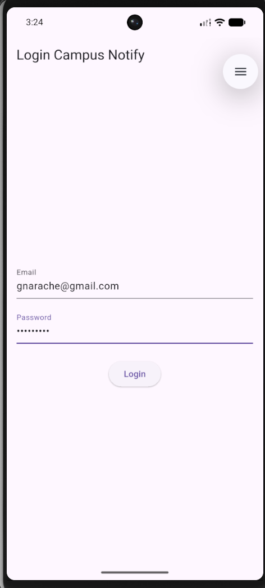

Berikut merupakan tampilan ketika menginputkan kridensial yang salah

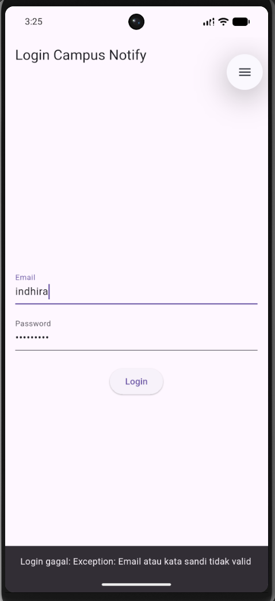

Berikut merupakan tampilan setelah berhasil login dengan valid

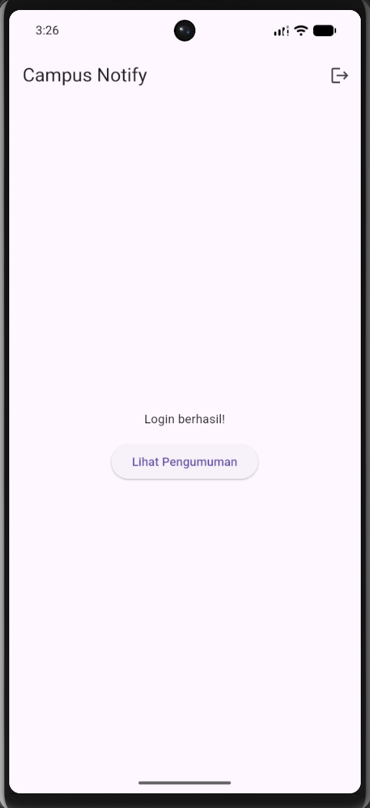

Berikut merupakan bukti routingnya berhasil setelah melakukan login

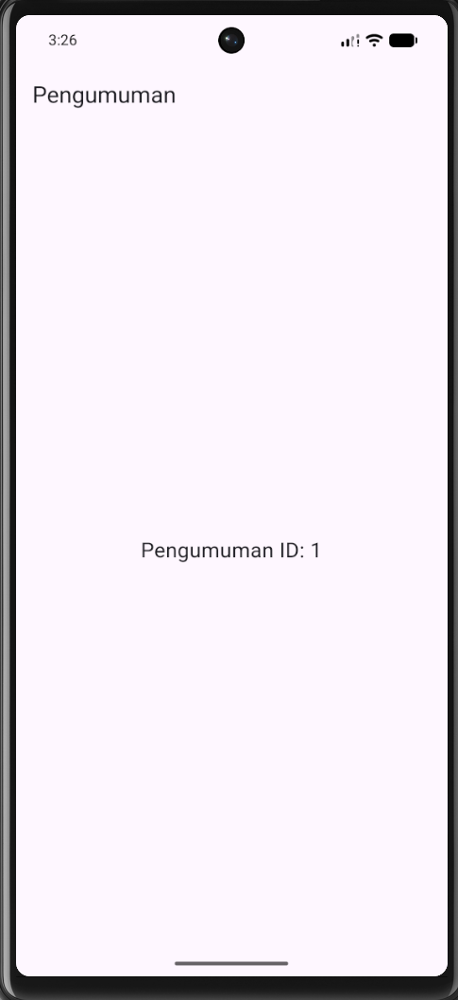

Setelah keluar dari aplikasi, lalu masuk kembali, akan langsung diarahkan ke beranda, sehingga tidak perlu login ulang.

---

## Praktikum 2: Firebase Cloud Messaging

Mendaftarkan aplikasi ke firebase

berikut merupakan tampilan dari firebase

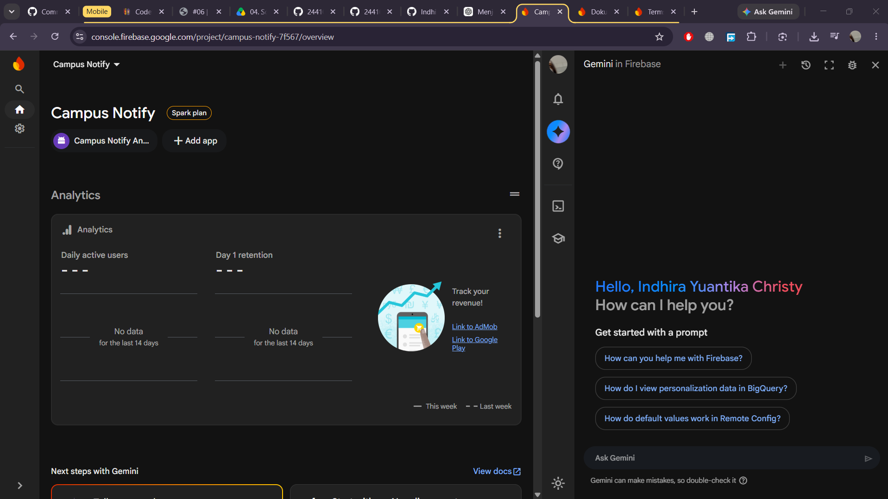

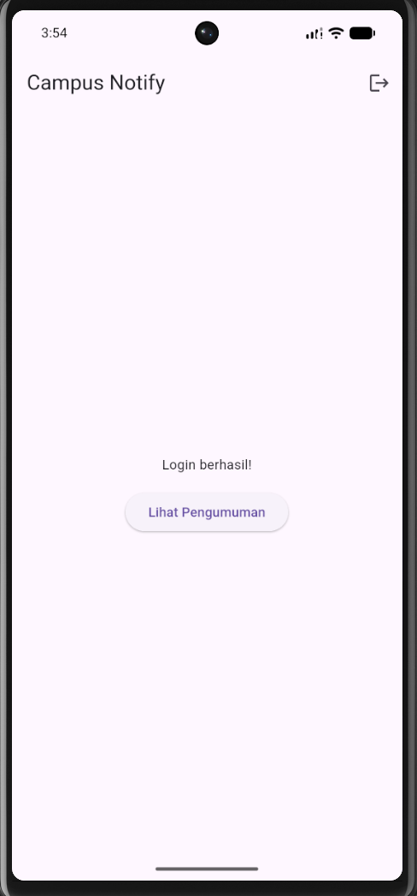

Meminta izin notifikasi

Berikut merupakan tampilan ketika meminta izin notifikasi dari aplikasi

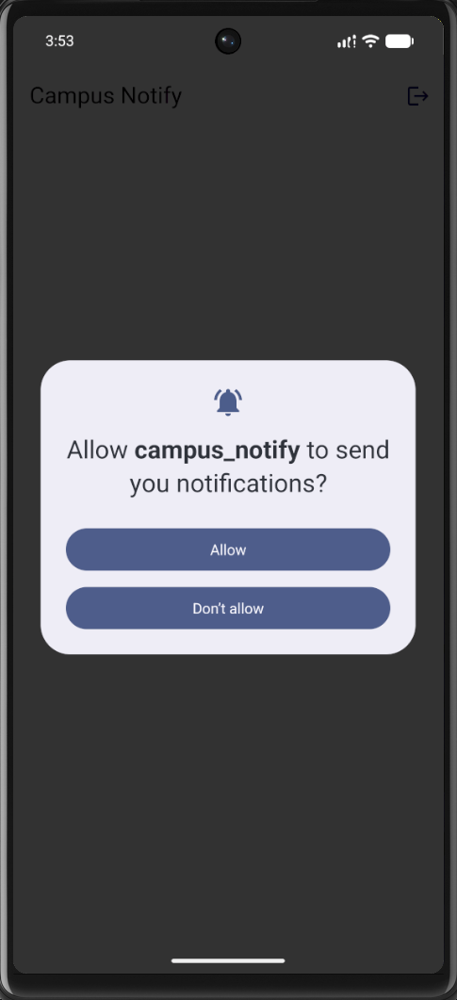

Mmebuat toke lifecycle

Berikut merupakan tampilan debug untuk token

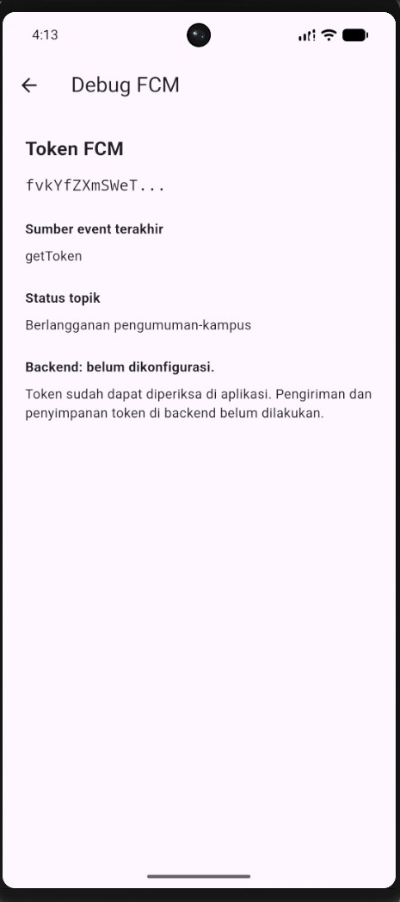

Menguji kirim pertama

Buka Firebase Console -> Messaging -> buat campaign notifikasi percobaan.
Masukkan title dan body, targetkan aplikasi Android Anda.
Kirim saat aplikasi dalam state background: banner sistem harus muncul. Klik banner: aplikasi terbuka.
Catat hasilnya sebagai bukti screenshots/fcm-console-test.png.

Berikut merupakan tampilan pada firebase untuk push notifications pertama

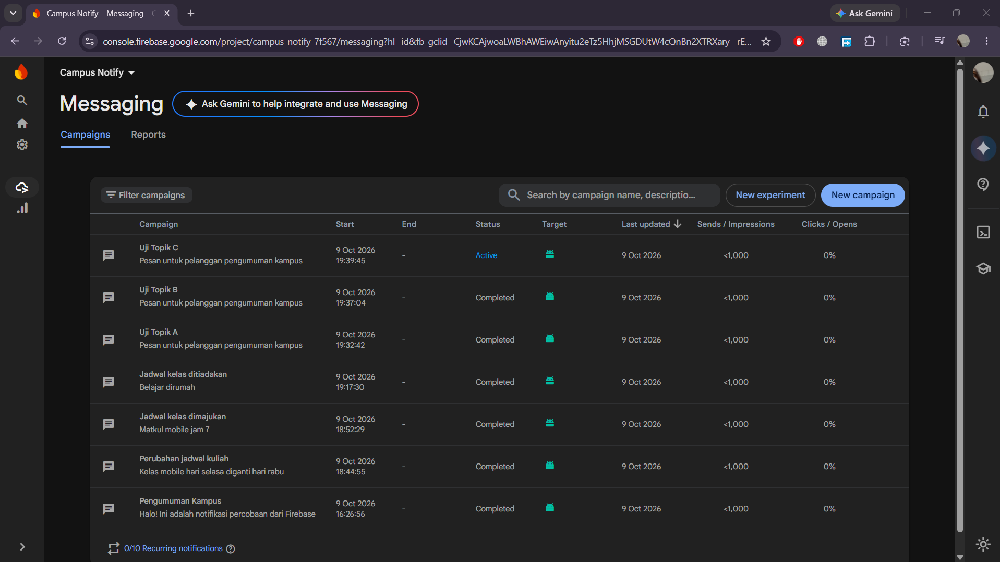

Berikut merupakan tampilan notifikasi, dan aplikasi yang dibuka setelah notifikasi diklik

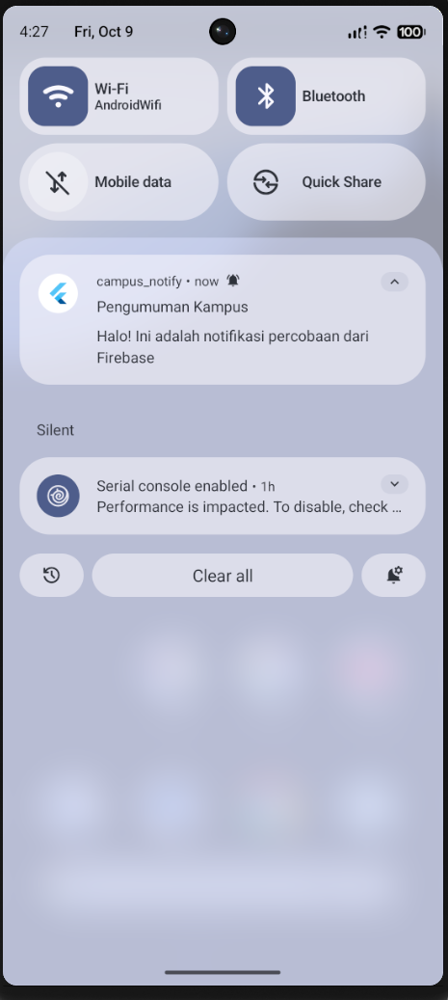

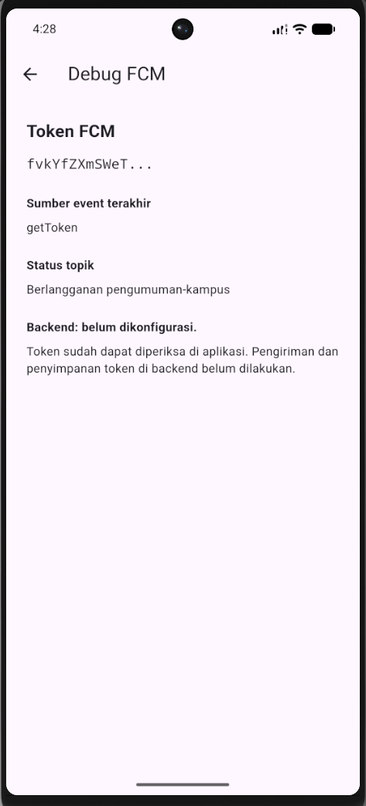

---

## Praktikum 3: Payload, Tiga App State, Klik dan Topik

Membuat Background Handler Top-Level

Menambahkan fungsi firebaseMessagingBackgroundHandler() pada file lib/messaging/push_service.dart. Fungsi diletakkan di luar kelas dan diberi anotasi @pragma('vm:entry-point').

Mendaftarkan handler melalui registerBackgroundHandler() pada main() sebelum menjalankan aplikasi. Handler digunakan untuk mencatat pesan background tanpa mengakses tampilan atau melakukan navigasi.

Membuat Tiga Handler dengan Payload Gabungan

Menggunakan payload gabungan yang berisi notification untuk judul dan isi notifikasi, serta data untuk menentukan halaman tujuan.

Menambahkan Custom data berikut saat mengirim notifikasi melalui Firebase Console:

| Key | Value |
| --- | --- |
| route | /pengumuman/3 |
| id | 3 |

Menguji Kondisi Foreground

Membuka aplikasi dan membiarkannya tampil di layar, kemudian mengirim notifikasi dari Firebase Console.

Berikut merupakan tampilan notifikasi lokal saat aplikasi berada di foreground.

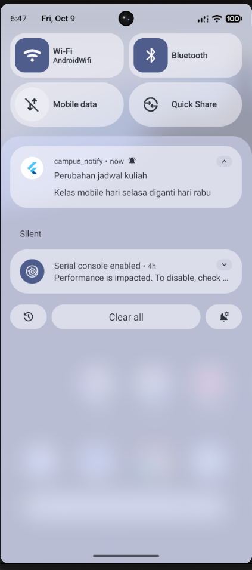

Mengetuk notifikasi untuk membuka halaman pengumuman dengan ID 3.


Menguji Kondisi Background

Menekan tombol Home pada emulator untuk memindahkan aplikasi ke background, kemudian mengirim notifikasi baru dengan payload yang sama.

Berikut merupakan tampilan notifikasi sistem saat aplikasi berada di background.

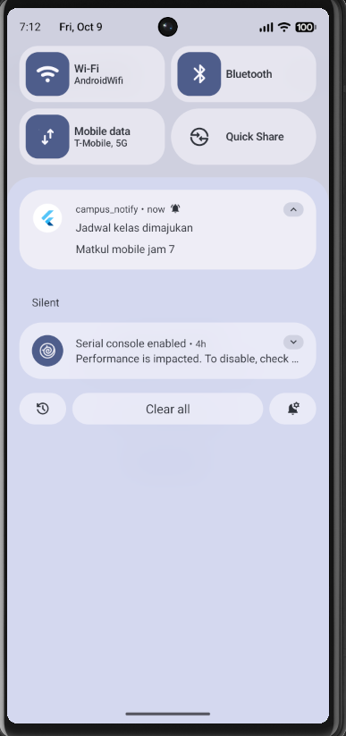

Mengetuk notifikasi untuk membuka halaman pengumuman dengan ID 3.

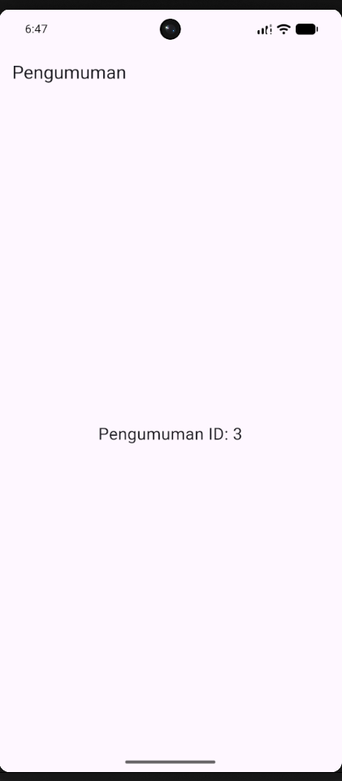

Menguji Kondisi Terminated

Menutup aplikasi dengan menggeser kartu Campus Notify pada Recent Apps, kemudian mengirim notifikasi baru dengan payload yang sama.

Berikut merupakan tampilan notifikasi ketika aplikasi sudah ditutup.

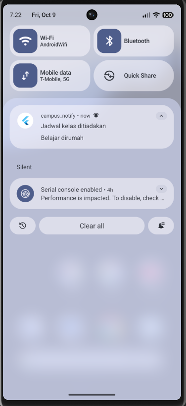

Mengetuk notifikasi untuk menjalankan aplikasi dan membuka halaman pengumuman dengan ID 3


---

### Matriks Pengujian

| State | Yang Diharapkan | Cara Uji | Hasil Pengujian |
| --- | --- | --- | --- |
| Foreground | Notifikasi lokal muncul dan klik membuka /pengumuman/3 | Membuka aplikasi, mengirim pesan, lalu mengetuk notifikasi | Notifikasi diterima dan klik membuka pengumuman ID 3 |
| Background | Notifikasi sistem muncul dan klik membuka /pengumuman/3 | Menekan Home, mengirim pesan, lalu mengetuk notifikasi | Notifikasi diterima dan klik membuka pengumuman ID 3 |
| Terminated | Aplikasi terbuka ke /pengumuman/3 melalui getInitialMessage() | Menutup aplikasi melalui Recent Apps, mengirim pesan, lalu mengetuk notifikasi | Aplikasi berjalan kembali dan membuka pengumuman ID 3 |

Topic Messaging

Menambahkan tombol Subscribe dan Unsubscribe pada halaman Debug untuk mengatur langganan topik pengumuman-kampus.

Menggunakan subscribeToTopic() untuk berlangganan dan unsubscribeFromTopic() untuk berhenti berlangganan.

Berikut merupakan tampilan tombol pengaturan topik pada halaman Debug.

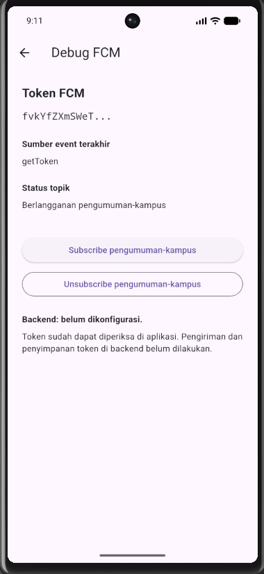

Memilih Topic dengan nama pengumuman-kampus sebagai target pengiriman pada Firebase Console.

Uji Topik A: Subscribe

Menekan tombol Subscribe dan menunggu proses berhasil, kemudian mengirim notifikasi berjudul “Uji Topik A”.

Berikut merupakan bukti pengujian saat aplikasi berlangganan topik.

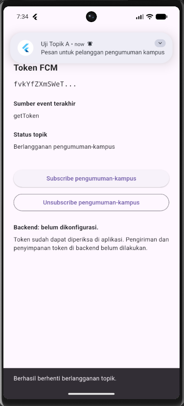

Uji Topik B: Unsubscribe

Menekan tombol Unsubscribe dan memastikan status berubah menjadi “Tidak berlangganan pengumuman-kampus”.

Menghapus notifikasi lama, kemudian mengirim pesan baru berjudul “Uji Topik B” ke topik yang sama. Mengamati panel notifikasi dan terminal tanpa melakukan restart aplikasi.

Berikut merupakan panel notifikasi selama pengamatan Uji Topik B.

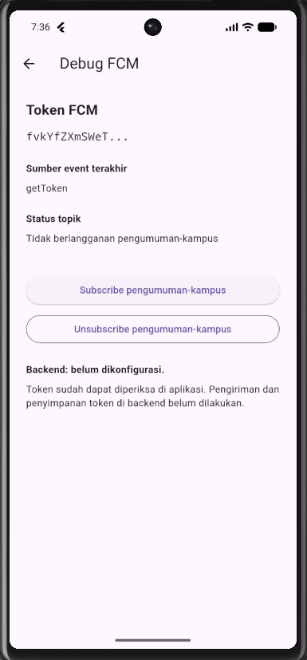

Uji Topik C: Subscribe Kembali

Menekan tombol Subscribe kembali, kemudian mengirim pesan baru berjudul “Uji Topik C ke topik yang sama.

Berikut merupakan bukti pengujian setelah berlangganan kembali.

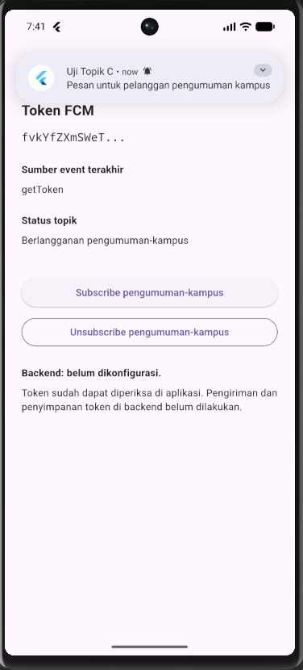

---

#### Hasil Pengujian Topik

| Pengujian | Status Langganan | Yang Diharapkan | Hasil Pengamatan |
| --- | --- | --- | --- |
| Uji Topik A | Subscribe | Perangkat menerima notifikasi yang dikirim ke topik `pengumuman-kampus`. | Notifikasi berhasil diterima setelah perangkat berlangganan topik `pengumuman-kampus`. |
| Uji Topik B | Unsubscribe | Perangkat tidak menerima notifikasi baru dari topik `pengumuman-kampus`. | Setelah berhenti berlangganan, tidak ditemukan notifikasi baru selama periode pengamatan setelah pesan pengujian dikirim. |
| Uji Topik C | Subscribe kembali | Perangkat kembali menerima notifikasi dari topik `pengumuman-kampus`. | Notifikasi berhasil diterima kembali setelah perangkat melakukan subscribe ulang. |

---

### Catatan implementasi `PushService`

`lib/messaging/push_service.dart` menyediakan satu `PushService` untuk:

- meminta izin notifikasi, mengambil token awal dengan `getToken`, dan
  mendaftarkan token ke `POST /devices`;
- mengirim token baru dari `onTokenRefresh` ke endpoint yang sama;
- menampilkan notifikasi lokal secara manual saat `onMessage` diterima;
- meneruskan `onMessageOpenedApp` dan `getInitialMessage` ke GoRouter
  menggunakan `data.route`;
- subscribe dan unsubscribe ke topik `pengumuman-kampus`.

Perbedaan platform ditandai langsung di source:

- **Android 13+** membutuhkan permission `POST_NOTIFICATIONS` pada
  `AndroidManifest.xml`. `PushService` juga memanggil
  `requestNotificationsPermission()` pada plugin local notifications dan
  membuat notification channel Android.
- **iOS** menggunakan permission FCM/APNs melalui `requestPermission()` dan
  konfigurasi `DarwinInitializationSettings`. Permission lokal pada plugin
  diatur `false` karena prompt ditangani oleh FCM.

`firebaseMessagingBackgroundHandler` adalah fungsi top-level dengan
`@pragma('vm:entry-point')`. Background isolate, callback notifikasi, dan
service messaging **tidak boleh mengakses `BuildContext`, `WidgetRef`, atau
melakukan navigasi langsung**. Callback route dikirim ke `main.dart`, lalu
GoRouter melakukan navigasi pada layer UI setelah status login siap.

---

## AI Challenge

1. Agent yang dipakai: Copilot

2. Prompt yang digunakan:

Aplikasi Flutter Campus Notification App.
Stack: firebase_messaging, flutter_local_notifications,
flutter_secure_storage, go_router, Riverpod.
Buatkan PushService dengan:
- requestPermission + getToken + onTokenRefresh (kirim ke POST /devices)
- onMessage (tampilkan local notification manual)
- onMessageOpenedApp + getInitialMessage (navigasi ke data.route)
- subscribe/unsubscribe topic pengumuman-kampus
- background handler top-level dengan @pragma('vm:entry-point')
Tandai bagian yang BERBEDA untuk Android 13+ vs iOS,
dan bagian yang tidak boleh mengakses BuildContext.

### 3. Output Awal AI

GitHub Copilot menghasilkan rancangan awal implementasi autentikasi dan Firebase Cloud Messaging (FCM) pada aplikasi Campus Notify. Implementasi mencakup inisialisasi Firebase, pengelolaan notifikasi, token FCM, topic messaging, navigasi, serta refresh token.

#### a. `main.dart` — Inisialisasi Firebase dan Navigasi

```dart
Future<void> main() async {
  WidgetsFlutterBinding.ensureInitialized();

  await Firebase.initializeApp();
  registerBackgroundHandler();

  runApp(const ProviderScope(child: MyApp()));
}
```

Kode tersebut menginisialisasi Firebase, mendaftarkan background handler, dan menjalankan aplikasi menggunakan Riverpod.

Navigasi notifikasi ditangani melalui GoRouter dengan mempertimbangkan status autentikasi pengguna.

```dart
void goFromNotification(String route) {
  if (!mounted) return;

  _pendingNotificationRoute = route;
  router.refresh();
}

await _pushService.initialize(
  onRoute: goFromNotification,
);
```

#### b. `debug_page.dart` — Pengelolaan Topic Messaging

GitHub Copilot menghasilkan halaman Debug FCM untuk menampilkan informasi token, sumber event, status langganan, serta tombol subscribe dan unsubscribe.

```dart
ElevatedButton(
  onPressed: () async {
    await pushService.subscribePengumuman();
  },
  child: const Text('Subscribe pengumuman-kampus'),
),

OutlinedButton(
  onPressed: () async {
    await pushService.unsubscribePengumuman();
  },
  child: const Text('Unsubscribe pengumuman-kampus'),
),
```

Fitur ini memungkinkan pengguna mengatur langganan topik `pengumuman-kampus` melalui aplikasi.

#### c. `push_service.dart` — Pengelolaan Firebase Cloud Messaging

**Background Handler**

```dart
@pragma('vm:entry-point')
Future<void> firebaseMessagingBackgroundHandler(
  RemoteMessage message,
) async {
  await Firebase.initializeApp();
  debugPrint('FCM background diterima: ${message.messageId}');
}
```

Background handler dibuat sebagai fungsi top-level agar dapat dijalankan ketika aplikasi berada di background tanpa mengakses `BuildContext` atau melakukan navigasi langsung.

**Permission dan Token FCM**

```dart
final settings = await _messaging.requestPermission(
  alert: true,
  badge: true,
  sound: true,
  provisional: true,
);

final token = await _messaging.getToken();

if (token != null) {
  await _registerDevice(
    token,
    source: 'getToken',
  );
}
```

Kode tersebut meminta izin notifikasi dan mengambil token FCM perangkat.

**Token Refresh**

```dart
_tokenSubscription = _messaging.onTokenRefresh.listen(
  (token) async {
    try {
      await _registerDevice(
        token,
        source: 'onTokenRefresh',
      );
    } catch (error) {
      debugPrint(
        'Registrasi token FCM yang diperbarui gagal: $error',
      );
    }
  },
);
```

Listener digunakan untuk mendeteksi perubahan token FCM dan mencoba mendaftarkannya kembali ke backend.

**Foreground Notification**

```dart
_foregroundSubscription =
    FirebaseMessaging.onMessage.listen(
  (message) async {
    final route = _notificationRoute(
      message.data['route']?.toString(),
    );

    await _local.show(
      id: message.hashCode & 0x7fffffff,
      title: message.notification?.title ?? 'Pengumuman',
      body: message.notification?.body ?? '',
      notificationDetails: const NotificationDetails(
        android: AndroidNotificationDetails(
          'pengumuman',
          'Pengumuman Kampus',
          importance: Importance.high,
          priority: Priority.high,
        ),
        iOS: DarwinNotificationDetails(),
      ),
      payload: route,
    );
  },
);
```

Notifikasi yang diterima saat aplikasi aktif ditampilkan menggunakan `flutter_local_notifications`.

**Background dan Terminated Notification**

```dart
_openedAppSubscription =
    FirebaseMessaging.onMessageOpenedApp.listen(
  (message) => onRoute(
    _notificationRoute(
      message.data['route']?.toString(),
    ),
  ),
);

final initial = await _messaging.getInitialMessage();

if (initial != null) {
  onRoute(
    _notificationRoute(
      initial.data['route']?.toString(),
    ),
  );
}
```

Kode tersebut menangani navigasi ketika notifikasi ditekan pada kondisi background maupun terminated.

**Topic Messaging**

```dart
Future<void> subscribePengumuman() async {
  await _messaging.subscribeToTopic(
    'pengumuman-kampus',
  );
}

Future<void> unsubscribePengumuman() async {
  await _messaging.unsubscribeFromTopic(
    'pengumuman-kampus',
  );
}
```

Kedua fungsi digunakan untuk mengelola langganan topik pengumuman kampus.

#### d. `api_client.dart` — Autentikasi dan Refresh Token

GitHub Copilot juga menghasilkan konfigurasi Dio untuk membaca access token dan melakukan refresh ketika server mengembalikan HTTP 401.

```dart
Dio buildApiClient(
  TokenStore store,
  AuthRepository auth,
) {
  final dio = Dio(
    BaseOptions(
      baseUrl: 'https://example-campus-api.test',
    ),
  );

  dio.interceptors.add(
    InterceptorsWrapper(
      onRequest: (options, handler) async {
        final access = await store.readAccess();

        if (access != null) {
          options.headers['Authorization'] =
              'Bearer $access';
        }

        handler.next(options);
      },
      onError: (e, handler) async {
        if (e.response?.statusCode == 401) {
          final refresh = await store.readRefresh();

          if (refresh == null) {
            return handler.next(e);
          }

          try {
            final renewed = await auth.refresh(refresh);

            await store.save(
              access: renewed,
              refresh: refresh,
            );

            final retry = await dio.fetch(
              e.requestOptions
                ..headers['Authorization'] =
                    'Bearer $renewed',
            );

            return handler.resolve(retry);
          } catch (_) {
            await store.clear();
          }
        }

        handler.next(e);
      },
    ),
  );

  return dio;
}
```

Cuplikan di atas memperlihatkan alur autentikasi yang dimaksud. Pada output awal Copilot yang terdokumentasi, nilai header Authorization masih berupa placeholder sehingga perlu diperbaiki. Mekanisme retry juga perlu dibatasi agar tidak terjadi pengulangan request tanpa batas.


4. AI Verification Checklist

- Apakah background handler berupa fungsi top-level dengan @pragma('vm:entry-point')? (tolak jika berupa method kelas).

Jawaban: Ya. Pada implementasi saat ini, firebaseMessagingBackgroundHandler() adalah fungsi top-level dan memiliki anotasi @pragma('vm:entry-point'). Handler hanya menginisialisasi Firebase dan mencatat message ID; tidak menggunakan BuildContext, Riverpod, atau navigasi. Karena dijalankan pada background isolate, handler harus tetap tidak bergantung pada state UI.

- Apakah onTokenRefresh benar-benar mengirim token baru ke backend, bukan hanya dicetak ke log?

Jawaban: Tidak. Listener onTokenRefresh memanggil callback yang saat ini hanya mencatat bahwa backend belum dikonfigurasi. Tidak ada pemanggilan api.post('/devices') di implementasi aktif. Base URL Dio masih https://example-campus-api.test dan header Authorization di api_client.dart juga masih placeholder '******'. Karena itu, pengiriman token maupun ketersediaan endpoint backend belum dibuktikan; status berhasil tidak boleh diklaim.

- Apakah foreground memakai local notification manual? (tanpa ini banner tidak muncul saat aplikasi terbuka).

Jawaban: Secara implementasi, ya: listener FirebaseMessaging.onMessage memanggil _local.show() dan menyertakan payload rute. Namun, konfigurasi inisialisasi local notification yang ada hanya mencakup Android; belum ada konfigurasi Darwin/iOS yang diperlukan untuk memastikan perilaku foreground yang setara. Perilaku aktual dan pencegahan banner ganda juga belum dibuktikan lewat uji perangkat.

- Apakah klik dari ketiga state (foreground/background/terminated) masuk ke rute yang benar? Buktikan dengan tabel pengujian.

Jawaban: Belum ada bukti pengujian runtime untuk ketiga keadaan ini. Kodenya menyediakan jalur penanganan foreground melalui callback local notification, background melalui onMessageOpenedApp, dan terminated melalui getInitialMessage(). Rute dari data.route divalidasi, lalu diteruskan ke GoRouter dengan mempertimbangkan status login. Tabel di bawah adalah rencana pengujian, bukan hasil yang sudah diamati:

| State | Cara pengujian | Hasil |
|---|---|---|
| Foreground | Membuka aplikasi, mengirim pesan, lalu mengetuk notifikasi lokal | Belum diuji pada perangkat |
| Background | Menekan Home, mengirim pesan, lalu mengetuk notifikasi | Belum diuji pada perangkat |
| Terminated | Menutup aplikasi melalui Recent Apps, mengirim pesan, lalu mengetuk notifikasi | Belum diuji pada perangkat |

- Apakah token/secret tidak di-hardcode dan tidak di-log penuh? Perbaiki bila AI melanggarnya.

Jawaban: Token FCM diperoleh secara dinamis dan tidak dicetak penuh, tetapi UI debug serta log masih menampilkan 12 karakter awal token; prefix ini tetap sebaiknya tidak ditampilkan pada build produksi. Token autentikasi disimpan melalui TokenStore, tetapi pemeriksaan kode menemukan api_client.dart mengirim nilai placeholder sebagai header Authorization, bukan token akses yang dibaca dari storage. Dengan demikian, autentikasi API belum berfungsi sebagaimana mestinya. Header dan token juga perlu dipastikan tidak ikut tercetak pada log.

- Keputusan final dan alasan teknis Anda, boleh berbeda dari saran AI selama berargumen.

Jawaban: Implementasi saat ini memenuhi sebagian kerangka FCM, tetapi belum memenuhi integrasi token ke backend: fungsi yang ada bukan kelas PushService, callback token hanya mencatat status konfigurasi, dan tidak ada request POST /devices. Handler top-level, listener pesan, navigasi dari beberapa state, serta operasi subscribe/unsubscribe topik sudah tersedia di kode, tetapi listener foreground dan klik notifikasi belum diuji pada perangkat. Pengaturan Android mencantumkan POST_NOTIFICATIONS dan membuat channel, sedangkan inisialisasi local notification belum menyediakan pengaturan iOS yang setara; target SDK efektif Android juga perlu diverifikasi. Sebelum menyatakan fitur selesai, perlu endpoint/backend yang benar, header autentikasi valid, konfigurasi iOS/APNs, dan pengujian nyata untuk token, permission, notifikasi, navigasi, serta lifecycle listener. README ini tidak menyatakan request backend atau pengujian perangkat berhasil.

---

## Refactoring, testing, dan error umum

Refactoring yang diterapkan:

- `lib/routes.dart` menjadi sumber konstanta rute untuk GoRouter dan deep link FCM. Fungsi murni `routeFromMessage(Map<String, dynamic> data)` menangani route kosong, tanpa slash, dan route tidak dikenal dengan aman.
- `lib/data/api_errors.dart` menyediakan pemetaan `DioException` menjadi pesan ramah pengguna, termasuk HTTP 401, timeout, dan gangguan koneksi. Halaman login menggunakan pemetaan tersebut.
- `lib/data/api_client.dart` dan `lib/providers/auth_provider.dart`menangani header Bearer dari token storage, pembatasan retry, penghapusan sesi ketika refresh gagal, dan perubahan status autentikasi.
- `lib/main.dart`, `lib/pages/home_page.dart`, dan `lib/messaging/push_service.dart` menggunakan konstanta/helper rute yang sama agar navigasi konsisten.
- `test/auth_push_test.dart` berisi unit test untuk parsing route, payload, sesi autentikasi, refresh gagal, header token, dan pemetaan error API.
- `test/widget_test.dart` menjalankan smoke test UI tanpa inisialisasi messaging native dengan `MyApp(enableMessaging: false)`.

### Perbaikan smoke test
Sebelumnya, widget test membangun `MyApp()` dan callback setelah frame memanggil inisialisasi messaging. Lingkungan widget test tidak menyediakan plugin Firebase native sehingga muncul pesan:

```text
Inisialisasi messaging gagal: LateInitializationError
```

Saya menambahkan parameter `enableMessaging` pada `MyApp` dengan nilai default `true`. Inisialisasi messaging hanya dijalankan ketika parameter tersebut aktif. Di `test/widget_test.dart`, aplikasi dibangun menggunakan:

```dart
await tester.pumpWidget(
  const ProviderScope(
    child: MyApp(enableMessaging: false),
  ),
);

expect(find.byType(MaterialApp), findsOneWidget);
expect(tester.takeException(), isNull);
```

Dengan cara ini, **aplikasi normal tetap menginisialisasi FCM**, sedangkan widget test menguji pembangunan UI tanpa bergantung pada plugin native. Ini bukan bukti bahwa Firebase Messaging berhasil diinisialisasi dalam widget test.

Berikut merupakan bukti hasil flutter test dan analze

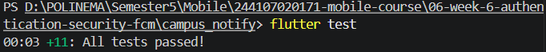

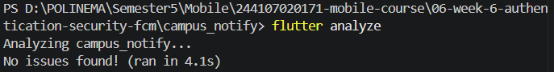


---

## Mini Project

 Persyaratan | Status |
| --- | --- |
| Login dan guard route | Diimplementasikan |
| Secure storage dan refresh token | Diimplementasikan; diuji melalui logika/fake dependency |
| FCM permission dan token lifecycle | Diimplementasikan; token diperoleh di perangkat |
| Registrasi token ke backend | Belum diverifikasi; backend belum tersedia |
| Notifikasi tiga app state dan deep link | Diuji dan didokumentasikan pada Praktikum 3 |
| Subscribe/unsubscribe topik | Diimplementasikan dan didokumentasikan |
| AI Challenge | Prompt, ringkasan output awal, verifikasi, dan perbaikan didokumentasikan di README |
| Refactoring dan unit test | Diimplementasikan; 11 test dilaporkan lulus sebelum perubahan smoke test terakhir |

---

## Refleksi

1. Mengapa refresh token tidak boleh disimpan di SharedPreferences? Apa risikonya bila bocor?

Jawaban: `SharedPreferences` bukan penyimpanan khusus rahasia. Refresh token lebih tepat disimpan menggunakan `flutter_secure_storage` yang memanfaatkan perlindungan platform. Jika refresh token bocor, pihak lain berpotensi memperoleh access token baru dan mengakses sesi pengguna sampai token dicabut atau kedaluwarsa.

2. Apa yang rusak bila onTokenRefresh diabaikan selama satu semester perkuliahan?

Jawaban: Token FCM dapat berubah karena instalasi ulang, reset data aplikasi, atau rotasi token. Jika backend masih menyimpan token lama, pengiriman notifikasi ke perangkat tersebut dapat gagal. Listener token harus memperbarui data di backend ketika endpoint sudah tersedia.

3. Kapan memakai topik dan kapan memakai token perangkat? Beri contoh pesan kampus untuk masing-masing.

Jawaban:3. Topik cocok untuk broadcast seperti pengumuman libur kampus atau kegiatan UKM. Token perangkat digunakan untuk pesan personal seperti pemberitahuan nilai atau tagihan UKT, dengan pengaitan pengguna dan otorisasi yang benar di backend.

4. Bagian mana dari draf AI yang Anda tolak atau perbaiki, dan mengapa?

Jawaban: Saya memusatkan string rute ke `routes.dart`, memisahkan `routeFromMessage()` agar bisa diuji tanpa Firebase, dan memindahkan pemetaan error Dio ke `api_errors.dart`. Saya juga memperbaiki alur autentikasi dan smoke test agar tidak memanggil plugin Firebase native. Usulan registrasi token ke `POST /devices` belum dianggap selesai karena endpoint backend belum tersedia; saya tidak mengklaim pengiriman token berhasil hanya berdasarkan kode atau log.

---

# Kesimpulan

Praktikum Week 6 menghasilkan aplikasi Campus Notify dengan autentikasi, penyimpanan token, integrasi FCM, navigasi notifikasi untuk foreground/background/terminated, dan topic messaging. Refactoring membuat pengelolaan rute, error API, dan logika autentikasi lebih terstruktur serta dapat diuji tanpa Firebase sungguhan. Pengujian unit dan smoke test membantu memverifikasi logika aplikasi, sedangkan pengiriman notifikasi dan deep link tetap membutuhkan pengujian pada emulator/perangkat. Integrasi backend `POST /devices` dan iOS/APNs masih menjadi batasan yang belum diverifikasi.